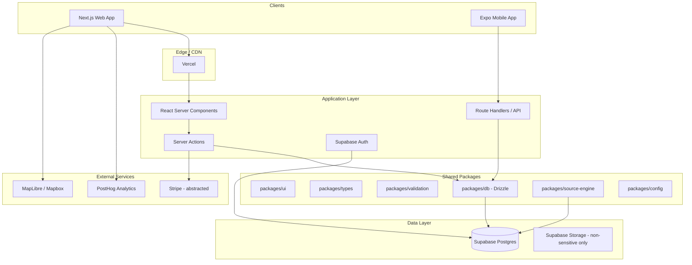

# Expat Atlas — Architecture

## System Overview



---

## Monorepo Structure

```
expat-atlas/
├── apps/
│   ├── web/                    # Next.js 15+ App Router
│   │   ├── app/
│   │   │   ├── (marketing)/    # Public routes
│   │   │   ├── (auth)/         # login, signup
│   │   │   ├── app/            # Authenticated user app
│   │   │   └── admin/          # RBAC admin
│   │   ├── components/
│   │   └── lib/
│   └── mobile/                 # Expo (Phase 6)
├── packages/
│   ├── ui/                     # shadcn + design tokens + shared components
│   ├── db/                     # Drizzle schema, migrations, queries
│   ├── types/                  # Shared TypeScript types
│   ├── validation/             # Zod schemas
│   ├── config/                 # eslint, tsconfig, tailwind presets
│   └── source-engine/          # Claim scoring, verification, adapters
├── supabase/
│   ├── migrations/
│   └── seed.sql
├── docs/                       # Planning docs (root-level also)
├── turbo.json
└── package.json
```

**Tooling:** pnpm workspaces + Turborepo.

---

## Route Architecture

### Public (marketing)

| Route | Purpose |
|-------|---------|
| `/` | Cinematic landing |
| `/countries`, `/countries/[slug]` | Country explorer |
| `/compare` | Country comparison |
| `/visa-compass` | Visa search/cards |
| `/passport-checklist` | Public checklist |
| `/budget-calculator` | Lightweight calculator |
| `/housing`, `/property`, `/insurance` | Education hubs |
| `/community`, `/partners`, `/become-a-partner` | Community + partner intake |
| `/pricing`, `/about`, `/trust`, `/blog` | Conversion + trust |
| `/login`, `/signup` | Auth |

### Authenticated (`/app/*`)

Dashboard, onboarding, readiness, my-plan, countries, compare, visa, passport, budget, housing, property, insurance, community, activities, reviews, saved, alerts, documents (metadata only), settings.

### Admin (`/admin/*`)

Countries, visa options, source claims, source watchlist, reviews, partners, sponsored placements, lead requests, reported info, content, users, audit log.

**Access:** `user_profiles.role IN ('admin', 'editor', 'moderator')` + middleware guard + RLS.

---

## Authentication & Authorization

| Concern | Approach |
|---------|----------|
| Auth provider | Supabase Auth (email + OAuth later) |
| Session | Supabase SSR cookies in Next.js middleware |
| Roles | `user`, `partner`, `editor`, `moderator`, `admin` |
| Admin routes | Middleware + server-side role check |
| Partner portal | Separate layout; `partner` role after verification |

---

## Source Engine (`packages/source-engine`)

Central trust layer. Not optional.

### Responsibilities

- Store and serve `source_claims` with metadata
- Compute display confidence/risk badges
- Queue user reports and admin review
- Adapter interface for future monitoring (no scraping-only truth)

### Adapters (future)

| Adapter | Input |
|---------|-------|
| `manual` | Admin entry |
| `url_monitor` | Official URL change detection |
| `visa_api` | Third-party requirements API |
| `partner_feed` | Verified partner updates |
| `user_report` | Outdated info reports |
| `ai_draft` | AI summary pending human approval |

### AI Expat Coach (MVP)

Rules-based or mocked UI. Must:

- Cite internal `source_claims` for factual statements
- Show uncertainty
- Refuse final legal/tax/medical authority
- Recommend officials/professionals for high-risk decisions

---

## Scoring Engines

### Country Fit Score

Shared logic in `packages/source-engine` (or `packages/scoring` if split later).

Dimensions: cost, visa, stay length, housing, healthcare, nature, safety, internet/work, social, family, property complexity, language, risk tolerance.

**Output:** explainable scores — never a black box number.

### Readiness Score

Derived from onboarding quiz + passport/budget/task completion.

### Budget Runway

Deterministic calculator in shared package; persisted as `budget_scenarios`.

---

## Data Access Patterns

| Pattern | Use case |
|---------|----------|
| Server Components + Drizzle | Read-heavy pages (countries, visa cards) |
| Server Actions | Forms, saves, reports |
| Route Handlers | Webhooks (Stripe, PostHog), mobile API |
| RLS policies | User-owned rows (`user_plans`, `saved_items`, etc.) |
| Service role | Admin batch jobs only (server-side) |

---

## Monetization Architecture

### Subscription tiers (metadata-driven)

```typescript
type PlanTier = 'free' | 'explorer' | 'builder' | 'serious_move' | 'concierge_waitlist';
```

- `pricing_plans` table or config file
- Feature gates via `packages/config/features.ts`
- Stripe Customer + Subscription IDs on `user_profiles` (nullable in MVP)

### Affiliate & sponsor tracking

- `affiliate_clicks` — outbound link events
- `sponsored_placements` — slot, partner, dates, disclosure text
- `lead_requests` — concierge, expert review, partner intake

All sponsored UI **must** render disclosure badges.

---

## Analytics (PostHog)

### Core events

| Event | When |
|-------|------|
| `landing_cta_click` | Hero/section CTAs |
| `onboarding_started` / `completed` | Quiz funnel |
| `country_viewed` / `compared` | Explorer |
| `visa_added_to_plan` | Visa Compass |
| `budget_calculated` | Calculator |
| `partner_apply_submitted` | Partner form |
| `waitlist_joined` | Concierge/expert waitlist |
| `report_outdated_info` | Source report |
| `subscription_checkout_started` | Pricing |

---

## Performance Strategy (Landing Page)

| Technique | Application |
|-----------|-------------|
| Dynamic import | Three.js globe, heavy chart libs |
| `prefers-reduced-motion` | Disable parallax / 3D |
| Image optimization | `next/image`, WebP/AVIF |
| Lazy sections | Below-fold marketing blocks |
| Skeleton states | Dashboard previews |
| Edge caching | Static marketing pages |

**Target:** LCP < 2.5s on mid-tier mobile; avoid animation jank.

---

## Security & Privacy (MVP)

- No passport/ID file storage
- Document checklist = metadata + reminders only
- Account deletion + data export placeholder
- Admin audit log for sensitive actions
- CSP headers on production
- Rate limiting on report/partner forms
- Input validation via Zod on all mutations

---

## Deployment

| Environment | Web | DB |
|-------------|-----|-----|
| Local | `pnpm dev` | Supabase local or cloud dev project |
| Preview | Vercel preview per PR | Supabase branch or shared staging |
| Production | Vercel production | Supabase production |

### CI (Phase 7)

- `turbo lint typecheck test`
- Playwright on critical paths
- Lighthouse CI on `/`

---

## Environment Variables

```bash
# Supabase
NEXT_PUBLIC_SUPABASE_URL=
NEXT_PUBLIC_SUPABASE_ANON_KEY=
SUPABASE_SERVICE_ROLE_KEY=

# App
NEXT_PUBLIC_APP_URL=
NEXT_PUBLIC_POSTHOG_KEY=
NEXT_PUBLIC_POSTHOG_HOST=

# Maps (optional Phase 1)
NEXT_PUBLIC_MAPLIBRE_STYLE_URL=

# Stripe (optional until live)
STRIPE_SECRET_KEY=
STRIPE_WEBHOOK_SECRET=
NEXT_PUBLIC_STRIPE_PUBLISHABLE_KEY=

# AI Coach (future)
ANTHROPIC_API_KEY=
```

---

## Known Limitations (MVP)

- No live partnerships or verified experts
- Visa/country data = seed + admin-managed claims with "needs verification" state
- AI Coach = rules-based mock until RAG pipeline ships
- Mobile = shared packages first; native shell in Phase 6
- Node/Git not yet configured on dev machine (see `SKILLS_INVENTORY.md`)
