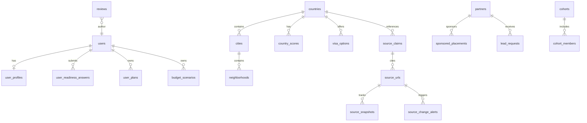

# Expat Atlas — Database Schema

**ORM:** Drizzle  
**Database:** Supabase Postgres  
**Conventions:** `uuid` PKs, `created_at` / `updated_at` timestamps, soft `status` enums where noted

---

## Entity Relationship (high level)



---

## Core Tables

### `users` (Supabase Auth — `auth.users`)

Managed by Supabase Auth. App tables reference `auth.users.id`.

### `user_profiles`

| Column | Type | Notes |
|--------|------|-------|
| id | uuid PK | FK → auth.users |
| display_name | text | |
| citizenship_country_code | char(2) | ISO |
| current_country_code | char(2) | |
| role | enum | user, partner, editor, moderator, admin |
| plan_tier | enum | free, explorer, builder, serious_move |
| stripe_customer_id | text | nullable |
| onboarding_completed_at | timestamptz | |
| readiness_score | int | 0–100 cached |
| preferred_regions | text[] | |
| created_at, updated_at | timestamptz | |

### `user_readiness_answers`

Quiz responses (JSONB `answers` + normalized columns for querying).

| Column | Type |
|--------|------|
| id | uuid PK |
| user_id | uuid FK |
| answers | jsonb |
| readiness_score | int |
| suggested_country_id | uuid FK countries |
| backup_country_ids | uuid[] |
| blockers | jsonb |
| warning_flags | jsonb |
| action_plan_30d | jsonb |
| created_at | timestamptz |

---

## Geography

### `countries`

| Column | Type | Notes |
|--------|------|-------|
| id | uuid PK | |
| slug | text UNIQUE | e.g. `philippines` |
| name | text | |
| region | text | |
| flag_emoji | text | |
| summary | text | editorial |
| hero_image_url | text | |
| is_published | boolean | |
| demo_data | boolean | clearly marked sample |
| created_at, updated_at | timestamptz | |

### `cities`

| Column | Type |
|--------|------|
| id | uuid PK |
| country_id | uuid FK |
| slug | text |
| name | text |
| latitude, longitude | decimal |
| summary | text |
| is_published | boolean |

**Unique:** `(country_id, slug)`

### `neighborhoods`

| Column | Type |
|--------|------|
| id | uuid PK |
| city_id | uuid FK |
| slug, name | text |
| summary | text |

### `country_scores`

Cached scoring dimensions per country (regenerated by engine).

| Column | Type |
|--------|------|
| id | uuid PK |
| country_id | uuid FK |
| dimension | enum | cost, visa, housing, ... |
| score | int | 0–100 |
| explanation | text |
| computed_at | timestamptz |

---

## Visa & Trust

### `visa_options`

| Column | Type | Notes |
|--------|------|-------|
| id | uuid PK | |
| country_id | uuid FK | |
| slug | text | |
| name | text | |
| category | enum | tourist_entry, digital_nomad, retirement, ... |
| overview | text | plain English |
| typical_stay | text | |
| extension_notes | text | |
| estimated_fees | text | planning estimate |
| required_documents | jsonb | |
| dependents_notes | text | |
| work_limitations | text | |
| renewal_notes | text | |
| risk_level | enum | low, medium, high |
| is_published | boolean | |
| created_at, updated_at | timestamptz | |

### `source_claims`

See `SOURCE_VERIFICATION_SYSTEM.md` for full field spec.

| Column | Type |
|--------|------|
| id | uuid PK |
| country_id | uuid FK nullable |
| visa_option_id | uuid FK nullable |
| category | text |
| claim_text | text |
| plain_english_summary | text |
| source_url | text |
| source_type | enum |
| source_name | text |
| last_checked_at | timestamptz |
| last_verified_at | timestamptz |
| last_changed_at | timestamptz |
| confidence_level | enum | low, medium, high |
| review_status | enum |
| reviewed_by | uuid FK nullable |
| expires_review_at | timestamptz |
| risk_level | enum |
| is_user_visible | boolean |
| requires_professional_review | boolean |
| notes | text |
| created_at, updated_at | timestamptz |

### `source_urls`

| Column | Type |
|--------|------|
| id | uuid PK |
| url | text UNIQUE |
| label | text |
| source_type | enum |
| country_id | uuid FK nullable |
| last_fetched_at | timestamptz |
| fetch_status | enum |

### `source_snapshots`

| Column | Type |
|--------|------|
| id | uuid PK |
| source_url_id | uuid FK |
| content_hash | text |
| snapshot_meta | jsonb |
| captured_at | timestamptz |

### `source_change_alerts`

| Column | Type |
|--------|------|
| id | uuid PK |
| source_url_id | uuid FK |
| claim_id | uuid FK nullable |
| change_summary | text |
| severity | enum |
| status | enum | open, acknowledged, resolved |
| created_at | timestamptz |

---

## User Planning

### `user_plans`

| Column | Type |
|--------|------|
| id | uuid PK |
| user_id | uuid FK |
| title | text |
| primary_country_id | uuid FK |
| status | enum | draft, active, archived |
| plan_data | jsonb | roadmap steps |
| created_at, updated_at | timestamptz |

### `user_tasks`

| Column | Type |
|--------|------|
| id | uuid PK |
| user_id | uuid FK |
| plan_id | uuid FK nullable |
| module | enum | passport, visa, budget, housing, ... |
| title | text |
| description | text |
| status | enum | not_started, in_progress, done, blocked, needs_review |
| due_at | timestamptz nullable |
| sort_order | int |
| created_at, updated_at | timestamptz |

### `user_saved_items`

| Column | Type |
|--------|------|
| id | uuid PK |
| user_id | uuid FK |
| item_type | enum | country, visa, housing, article |
| item_id | uuid |
| created_at | timestamptz |

**Unique:** `(user_id, item_type, item_id)`

### `budget_scenarios`

| Column | Type |
|--------|------|
| id | uuid PK |
| user_id | uuid FK |
| name | text |
| inputs | jsonb |
| outputs | jsonb |
| risk_level | enum |
| runway_months | decimal |
| created_at, updated_at | timestamptz |

### `passport_checklists`

| Column | Type |
|--------|------|
| id | uuid PK |
| user_id | uuid FK |
| is_first_time | boolean |
| items | jsonb | checklist state |
| expiration_reminder_at | timestamptz |
| created_at, updated_at | timestamptz |

---

## Housing & Property

### `housing_listings`

| Column | Type | Notes |
|--------|------|-------|
| id | uuid PK | |
| country_id, city_id, neighborhood_id | uuid FK | |
| title | text | |
| price_monthly | decimal | |
| term_length | text | |
| furnished | boolean | |
| deposit | decimal | |
| utilities_included | boolean | |
| internet_notes | text | |
| pet_policy | text | |
| verification_status | enum | demo, pending, verified |
| partner_id | uuid FK nullable | |
| sponsored | boolean | |
| risk_notes | text | |
| is_published | boolean | |
| created_at, updated_at | timestamptz | |

**MVP:** demo listings only, `verification_status = demo`.

### `property_guides`

Education content per country (foreign ownership rules, red flags).

| Column | Type |
|--------|------|
| id | uuid PK |
| country_id | uuid FK |
| sections | jsonb |
| disclaimer | text |
| is_published | boolean |

### `insurance_options`

Affiliate-ready education cards (not direct sales).

| Column | Type |
|--------|------|
| id | uuid PK |
| category | enum |
| name | text |
| summary | text |
| affiliate_url | text nullable |
| partner_id | uuid FK nullable |
| is_published | boolean |

---

## Community & Reviews

### `cohorts`

| Column | Type |
|--------|------|
| id | uuid PK |
| slug | text UNIQUE |
| name | text |
| destination_country_id | uuid FK nullable |
| description | text |
| status | enum | waitlist, active, archived |
| max_members | int nullable |

### `cohort_members`

| Column | Type |
|--------|------|
| id | uuid PK |
| cohort_id | uuid FK |
| user_id | uuid FK |
| status | enum | waitlist, active, left |
| joined_at | timestamptz |

### `reviews`

| Column | Type |
|--------|------|
| id | uuid PK |
| author_id | uuid FK |
| target_type | enum | country, city, neighborhood, rental, ... |
| target_id | uuid |
| ratings | jsonb | dimension scores |
| body | text |
| moderation_status | enum | pending, approved, rejected |
| created_at | timestamptz |

### `review_reports`

| Column | Type |
|--------|------|
| id | uuid PK |
| review_id | uuid FK |
| reporter_id | uuid FK |
| reason | text |
| status | enum |

---

## Partners & Monetization

### `partners`

| Column | Type | Notes |
|--------|------|-------|
| id | uuid PK | |
| business_name | text | |
| contact_email | text | |
| website | text | |
| countries_served | text[] | |
| cities_served | text[] | |
| service_category | enum | |
| status | enum | draft, pending_verification, verified, rejected, suspended, sponsored, demo |
| verification_notes | text | |
| is_demo | boolean | |
| created_at, updated_at | timestamptz | |

### `partner_applications`

Intake before `partners` record created.

| Column | Type |
|--------|------|
| id | uuid PK |
| form_data | jsonb |
| status | enum | submitted, under_review, approved, rejected |
| reviewed_by | uuid FK nullable |
| created_at | timestamptz |

### `sponsored_placements`

| Column | Type |
|--------|------|
| id | uuid PK |
| slot | enum | landing, country_page, housing, ... |
| partner_id | uuid FK |
| disclosure_text | text |
| starts_at, ends_at | timestamptz |
| click_count | int default 0 |
| is_active | boolean |

### `lead_requests`

| Column | Type |
|--------|------|
| id | uuid PK |
| user_id | uuid FK nullable |
| partner_id | uuid FK nullable |
| request_type | enum | concierge, expert_review, housing, property |
| payload | jsonb |
| status | enum | new, contacted, closed |
| created_at | timestamptz |

### `affiliate_clicks`

| Column | Type |
|--------|------|
| id | uuid PK |
| user_id | uuid FK nullable |
| link_key | text |
| destination_url | text |
| created_at | timestamptz |

### `waitlist_entries`

| Column | Type |
|--------|------|
| id | uuid PK |
| email | text |
| waitlist_type | enum | concierge, expert, cohort, partner |
| metadata | jsonb |
| created_at | timestamptz |

---

## Content & Admin

### `content_pages`

CMS-lite for trust, about, static hubs.

### `blog_posts`

| Column | Type |
|--------|------|
| id | uuid PK |
| slug | text UNIQUE |
| title | text |
| excerpt | text |
| body | text |
| published_at | timestamptz |
| seo_meta | jsonb |

### `admin_audit_logs`

| Column | Type |
|--------|------|
| id | uuid PK |
| actor_id | uuid FK |
| action | text |
| entity_type | text |
| entity_id | uuid |
| diff | jsonb |
| created_at | timestamptz |

---

## Indexes (recommended)

```sql
CREATE INDEX idx_countries_slug ON countries(slug);
CREATE INDEX idx_visa_options_country ON visa_options(country_id);
CREATE INDEX idx_source_claims_country ON source_claims(country_id);
CREATE INDEX idx_source_claims_review ON source_claims(review_status, expires_review_at);
CREATE INDEX idx_user_tasks_user_status ON user_tasks(user_id, status);
CREATE INDEX idx_partners_status ON partners(status);
CREATE INDEX idx_reviews_moderation ON reviews(moderation_status);
```

---

## RLS Policies (summary)

| Table | Policy |
|-------|--------|
| `user_*` | Owner read/write |
| `countries`, `visa_options`, `source_claims` (visible) | Public read if published + `is_user_visible` |
| `partners` | Public read only `verified` or `demo` with label |
| `admin_*` | Service role or admin JWT claim |
| `partner_applications` | Insert public; read admin only |

---

## Seed Data (Phase 1)

**Countries:** Philippines, Thailand, Mexico, Colombia, Portugal, Vietnam, Costa Rica, Panama, Indonesia

**Cities:** per `PROJECT_BRIEF.md` seed list

All seed visa/financial figures: `review_status = needs_review`, `confidence_level = low`, `demo_data = true` unless admin verifies.
