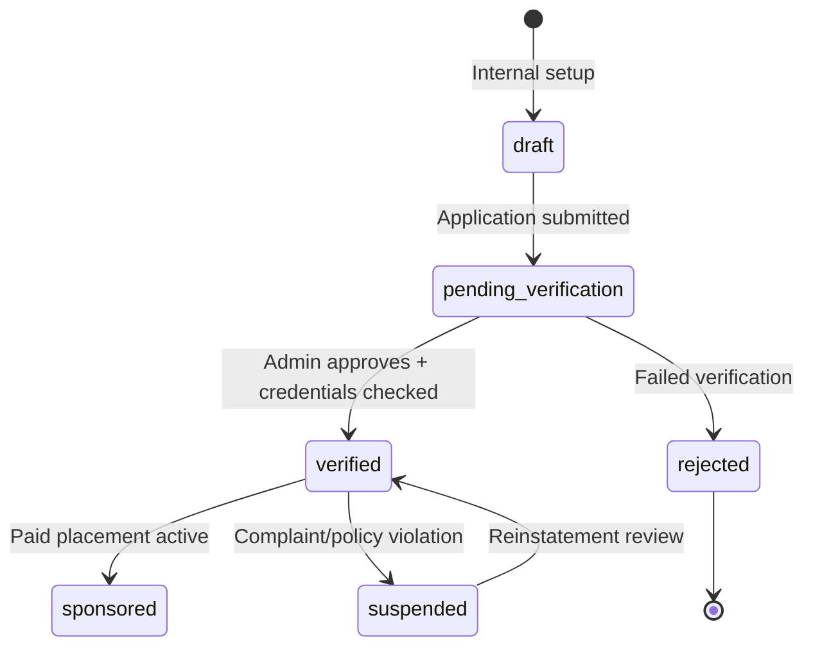

# Expat Atlas — Partner Strategy

**Principle:** Build the partner *system* now. Plug in real humans only after verification.

---

## Partner Types (directory taxonomy)

| Category | Future value | MVP state |
|----------|--------------|-----------|
| Immigration attorney | Expert review, lead fees | Application form + empty state |
| Visa consultant | Visa path guidance | Demo card slot |
| Relocation consultant | Full-move planning | Waitlist intake |
| Real estate attorney | Property due diligence | Education hub referral placeholder |
| Real estate agent | Buying/renting | Demo only |
| Rental provider | Medium-term housing | Listing schema; no fake inventory |
| Insurance broker | Health/travel coverage | Affiliate placeholder |
| Tour guide | Soft landing | Demo slot |
| Coworking space | Remote worker fit | Demo slot |
| Hotel/serviced apartment | First 30 days | Affiliate-ready |
| Language tutor | Integration | Directory slot |
| Tax advisor | Nomad tax caution | Disclaimer + waitlist |
| Document/apostille service | Passport pipeline | Affiliate placeholder |
| Healthcare provider | Insurance hub | Education only |

---

## Partner Lifecycle

### Status definitions

| Status | UI label | Public visible |
|--------|----------|----------------|
| `draft` | Internal only | No |
| `pending_verification` | Partner verification pending | No |
| `verified` | Verified partner | Yes |
| `rejected` | Not available | No |
| `suspended` | Temporarily unavailable | No |
| `sponsored` | Sponsored · Verified | Yes (with disclosure) |
| `demo` | Demo listing | Yes (clearly labeled) |

---

## Application Flow

1. User visits `/become-a-partner`
2. Submits: business name, contact, countries/cities, category, credentials (upload placeholder), languages, description, consent, sponsorship interest
3. Record → `partner_applications` status `submitted`
4. Admin reviews in `/admin/partners`
5. On approve → create `partners` row with `verified` or keep `pending` for more docs
6. On reject → email template (future) + audit log

**Never auto-approve.**

---

## Sponsored Placement System

### Slots (build all; fill later)

| Slot ID | Location | Max active |
|---------|----------|------------|
| `landing_sponsor` | Homepage partner teaser | 3 |
| `country_page` | Country detail sidebar | 1 per country |
| `city_guide` | City/neighborhood guide | 1 |
| `housing_card` | Housing hub | 2 |
| `insurance_card` | Insurance hub | 2 |
| `activity_card` | Activities module | 2 |
| `directory_featured` | Partners index | 5 |
| `newsletter` | Email (future) | 1 |
| `report_sponsor` | Premium report PDF (future) | 1 |

### Required disclosure (every sponsored item)

- Visible **Sponsored** badge
- Partner type label
- Verification status
- Short disclosure: “Expat Atlas may receive compensation. This does not affect editorial scores.”
- Start/end dates in admin
- Click + lead tracking

### Ranking rules

- Editorial country fit scores **never** boosted by sponsorship
- Sponsored items appear in labeled slots only
- Optional “Featured” section separate from “Best fit for you”

---

## Revenue Models (future)

| Model | Trigger | Implementation |
|-------|---------|----------------|
| Directory subscription | Partner wants listing | Stripe partner plan (Phase 4+) |
| Qualified lead fee | User requests expert review | `lead_requests` + CRM export |
| Featured placement | Sponsored slot purchase | `sponsored_placements` + dates |
| Webinar sponsorship | Marketing event | Manual admin |
| Relocation package intake | High-intent user | Concierge form |

---

## User-Side Expert Help (no fake experts)

### Empty states

- “No verified partners available yet in [country]”
- “Join waitlist for expert help”
- “Apply to become a partner”

### Waitlists

| Type | Table |
|------|-------|
| Concierge planning | `waitlist_entries` type `concierge` |
| Expert visa review | `expert` |
| Housing help | `housing` |

---

## Affiliate vs Partner

| | Affiliate | Partner |
|---|-----------|---------|
| Relationship | Link-based | Verified business |
| Label | Affiliate link | Verified partner / Sponsored |
| Examples | SafetyWing, eSIM, VPN | Attorney, relocation firm |
| Verification | Program TOS only | Admin credential review |

---

## Go-to-Market (post-MVP)

### Phase A — Philippines focus
1. 2–3 immigration attorneys (manual outreach)
2. 1 relocation/community organizer
3. 1 insurance affiliate (program signup)

### Phase B — Expand corridors
Thailand, Mexico, Portugal — replicate playbook

### Phase C — Marketplace
Consultation booking, coworking, tours (Stripe Connect later)

---

## Do-Not-Do List

- Do not invent attorney names, firms, or testimonials
- Do not use stock photos labeled as “our partners”
- Do not imply government endorsement
- Do not mix sponsored rankings with fit scores
- Do not charge partners before verification workflow exists

---

## Success Metrics

| Metric | Target (6 mo post-launch) |
|--------|---------------------------|
| Partner applications | 50+ |
| Verified partners | 10+ (real) |
| Lead requests/month | 100+ |
| Sponsored slot fill rate | 25% of slots |
| User trust score (survey) | ≥ 4.2/5 |
