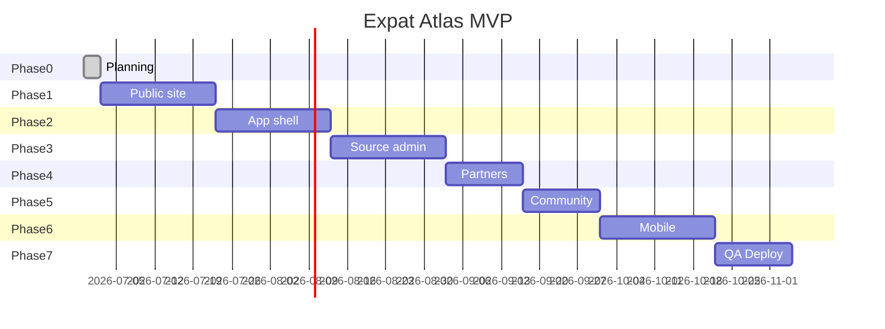

# Expat Atlas — Roadmap

**Last updated:** 2026-06-29  
**Current phase:** 1 complete locally — deploy triggers on push to `main`

---

## Phase 0 — Setup & Planning ✅

- [x] Evaluate and install agent skills (see `SKILLS_INVENTORY.md`)
- [x] Create project workspace `expat-atlas`
- [x] Planning docs complete
- [x] Node + Git on dev machine (portable Node)
- [x] Git repo + pnpm monorepo scaffold

---

## Phase 1 — Public Authority Site (Weeks 1–3)

### Infrastructure
- [x] pnpm + Turborepo monorepo
- [x] `apps/web` Next.js App Router + Tailwind
- [x] `packages/ui`, `types`, `validation`, `config`
- [x] `packages/db` Drizzle schema starter
- [x] `packages/source-engine` badge helpers
- [x] Env templates
- [ ] Supabase project + migrations

### Pages
- [x] `/` landing (globe + dashboard preview + journey)
- [x] `/countries` index + `/countries/[slug]` template
- [x] `/compare` (functional side-by-side)
- [x] `/visa-compass` (seed cards)
- [x] `/passport-checklist` (interactive)
- [x] `/budget-calculator` (interactive)
- [x] `/trust` — sourcing model
- [x] `/pricing` (tier UI)
- [x] `/become-a-partner` + `/partners` placeholder
- [x] `/about`
- [x] `/privacy` + `/terms`
- [x] `/housing`, `/property`, `/insurance`, `/community`, `/blog` stubs
- [x] Custom 404 (`not-found.tsx`)

### Data & QA
- [x] Seed 9 countries (TS module)
- [x] Demo visa cards with `needs_review` claims
- [x] robots.txt + sitemap.xml
- [x] Playwright smoke tests (config)
- [ ] Vercel production deploy (auto on push to `main`)

**Exit criteria:** Landing deploys to Vercel preview; Lighthouse mobile ≥ 80; trust disclaimers on all legal-adjacent pages.

---

## Phase 2 — App Shell (Weeks 4–6)

- [ ] Supabase Auth (email magic link or password)
- [ ] `/app/onboarding` — readiness quiz
- [ ] `/app/dashboard` — readiness score, next step, best fit
- [ ] `/app/my-plan` — 30-day action plan
- [ ] `/app/passport`, `/app/budget` — persisted state
- [ ] `/app/saved`, `/app/settings`
- [ ] Feature gates by plan tier (metadata only)

**Exit criteria:** User can sign up, complete quiz, see dashboard, save countries, persist budget + passport checklist.

---

## Phase 3 — Source Engine & Admin (Weeks 7–9)

- [ ] `packages/source-engine`
- [ ] Full `source_claims` CRUD in admin
- [ ] Official URL, last verified, confidence UI on country/visa pages
- [ ] User “report outdated info” flow
- [ ] Admin report queue
- [ ] `source_watchlist` + placeholder snapshot job structure

**Exit criteria:** No hard-coded legal claims without source metadata; admin can verify and publish claims.

---

## Phase 4 — Partner & Sponsor Readiness (Weeks 10–11)

- [ ] Partner application form → `partner_applications`
- [ ] Admin partner approval queue
- [ ] Partner statuses + demo cards
- [ ] `sponsored_placements` schema + admin UI
- [ ] Sponsored/affiliate disclosure components
- [ ] Lead request intake + waitlists

**Exit criteria:** Partner pipeline works end-to-end with demo data; no fake verified partners.

---

## Phase 5 — Community & Reviews (Weeks 12–13)

- [ ] Cohorts + waitlist join
- [ ] Review submission + moderation queue
- [ ] Report/block user (basic)
- [ ] Field reports on countries/cities

**Exit criteria:** Reviews require moderation; no unsafe stranger matching.

---

## Phase 6 — Mobile (Weeks 14–16)

- [ ] `apps/mobile` Expo scaffold
- [ ] Shared tokens, types, validation, scoring
- [ ] Dashboard, plan, checklist, budget, saved, visa screens
- [ ] EAS config (build not required for MVP exit)

**Exit criteria:** Core flows work on iOS/Android simulator.

---

## Phase 7 — QA & Deployment (Weeks 17–18)

- [ ] Playwright: landing CTA, signup, onboarding, budget
- [ ] Vitest: scoring + budget calculators
- [ ] axe accessibility pass
- [ ] Lighthouse CI
- [ ] Security review (`gstack-cso`)
- [ ] Seed script docs
- [ ] Production deploy + admin bootstrap

**Exit criteria:** CI green; production URL live; README runbook complete.

---

## Post-MVP Priorities

1. Live Stripe subscriptions
2. AI Expat Coach with RAG over `source_claims`
3. Source URL monitoring adapters
4. First verified partner onboarding (manual)
5. Premium country reports
6. SEO content pipeline (`/blog`)
7. PostHog funnel dashboards
8. Document vault (only after security architecture)

---

## Milestone Timeline (visual)

---

## Definition of Done (MVP)

A first-time user can:

1. Land on a premium, trustworthy homepage
2. Compare countries and read source-backed visa info (with disclaimers)
3. Sign up and complete readiness quiz
4. See personalized dashboard with next steps
5. Track passport checklist and budget runway
6. Report outdated information
7. Join partner/concierge waitlists

A founder can:

1. Admin-verify source claims and partners
2. Add sponsored placements without code changes
3. See lead and affiliate event data in PostHog
