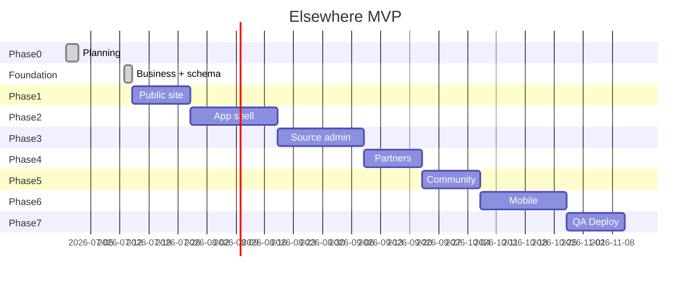

# Elsewhere — Roadmap

**Last updated:** 2026-07-13  
**Brand:** Elsewhere (repo folder still `expat-atlas` until rename)  
**Current phase:** Foundation + business plan staged; v1 corridors PH / TH / MX  

**Master trackers:** `docs/plans/BUILD_CHECKLIST.md` · `docs/plans/BUSINESS_PLAN_AND_LAUNCH_REPORT.md` · `docs/plans/ELSEWHERE_FOUNDATION.md`

---

## Phase 0 — Setup & Planning ✅

- [x] Evaluate and install agent skills (see `SKILLS_INVENTORY.md`)
- [x] Create project workspace `expat-atlas`
- [x] Planning docs complete
- [x] Node + Git on dev machine (portable Node)
- [x] Git repo + pnpm monorepo scaffold
- [x] Elsewhere brand charter + business plan + build checklist (2026-07-13)

---

## Phase 1 — Public Authority Site (Weeks 1–3)

### Infrastructure
- [x] pnpm + Turborepo monorepo
- [x] `apps/web` Next.js App Router + Tailwind
- [x] `packages/ui`, `types`, `validation`, `config`
- [x] `packages/db` Drizzle schema (countries, claims, **corridors, path_packs, partners, leads**)
- [x] `packages/source-engine` badge helpers
- [x] Source claim display card + seed claims for PH/TH/MX
- [x] Env templates
- [ ] Supabase project + migrations

### Pages
- [x] `/` landing (globe + dashboard preview + journey)
- [x] `/countries` index + `/countries/[slug]` with source claim cards
- [x] `/corridors` — launch corridor list (PH / TH / MX)
- [x] `/compare` (functional side-by-side)
- [x] `/visa-compass` (seed cards)
- [x] `/passport-checklist` (interactive)
- [x] `/budget-calculator` (interactive)
- [x] `/trust` — sourcing model
- [x] `/pricing` (tier UI)
- [x] `/become-a-partner` + `/partners` placeholder
- [x] `/about`
- [x] `/privacy` + `/terms`
- [x] `/housing`, `/property`, `/insurance`, `/community`, `/blog` content stubs
- [x] Custom 404 (`not-found.tsx`)

### Data & QA
- [x] Seed 9 countries (TS module)
- [x] Demo visa cards with `needs_review` claims
- [x] Launch corridor + path pack seeds
- [x] robots.txt + sitemap.xml
- [x] Playwright smoke tests (config)
- [ ] Vercel production deploy of latest foundation (push when ready)
- [ ] Rebrand user-facing strings to Elsewhere

**Exit criteria:** Landing deploys; trust disclaimers on legal-adjacent pages; corridors listed; claims show honesty badges.

---

## Phase 2 — App Shell (Weeks 4–6)

- [x] Demo account flow (localStorage until Supabase) — local; may be unpushed
- [x] `/app/onboarding` — readiness quiz
- [x] `/app/dashboard` — readiness score, next step, best fit
- [x] `/app/my-plan` — 30-day action plan template
- [x] `/app/passport`, `/app/budget` — same tools in app shell
- [x] `/app/saved`, `/app/settings`
- [ ] Port Elsewhere Fit Quiz UX (data-driven path packs)
- [ ] Supabase Auth (email magic link or password)
- [ ] Drizzle migrations + persisted DB state
- [ ] Feature gates by plan tier (metadata only)

**Exit criteria:** User can complete quiz, see corridor path, track checklist — accounts real when Supabase wired.

---

## Phase 3 — Source Engine & Admin (Weeks 7–9)

- [x] Claim display framework (UI)
- [ ] Full `source_claims` CRUD in admin
- [ ] Official URL, last verified, confidence UI on all visa packs
- [ ] User “report outdated info” → admin queue
- [ ] `source_watchlist` + placeholder snapshot job structure

**Exit criteria:** No hard-coded legal claims without source metadata; admin can verify and publish claims.

---

## Phase 4 — Partner & Sponsor Readiness (Weeks 10–11)

- [x] Partner application form → schema ready
- [ ] Admin partner approval queue
- [ ] Partner statuses + demo cards
- [ ] `sponsored_placements` schema + admin UI
- [ ] Sponsored/affiliate disclosure components
- [ ] Lead request intake + waitlists

**Exit criteria:** Partner pipeline works end-to-end with demo data; no fake verified partners.

---

## Phase 5 — Community & Reviews (Weeks 12–13)

- [ ] Cohorts + waitlist join
- [ ] Review submission + moderation queue
- [ ] Report/block user (basic)
- [ ] Field reports on countries/cities

**Exit criteria:** Reviews require moderation; no unsafe stranger matching.

---

## Phase 6 — Mobile (Weeks 14–16)

- [ ] `apps/mobile` Expo scaffold
- [ ] Shared tokens, types, validation, scoring
- [ ] Dashboard, plan, checklist, budget, saved, visa screens
- [ ] EAS config (build not required for MVP exit)

**Exit criteria:** Core flows work on iOS/Android simulator.

---

## Phase 7 — QA & Deployment (Weeks 17–18)

- [ ] Playwright: landing CTA, signup, onboarding, budget
- [ ] Vitest: scoring + budget calculators
- [ ] axe accessibility pass
- [ ] Lighthouse CI
- [ ] Security review (`gstack-cso`)
- [ ] Seed script docs
- [ ] Production deploy + admin bootstrap
- [ ] Brand DNS cutover to Elsewhere

**Exit criteria:** CI green; production URL live; README runbook complete.

---

## Post-MVP Priorities

1. Live Stripe subscriptions (Explorer / Builder)
2. Additional corridors (Portugal, Colombia, Vietnam, …) as **data**
3. AI Expat Coach with RAG over `source_claims`
4. Source URL monitoring adapters
5. First verified partner onboarding (manual)
6. Premium country reports
7. SEO content pipeline (`/blog`)
8. PostHog funnel dashboards
9. Document vault (only after security architecture)

---

## Milestone Timeline (visual)

---

## Definition of Done (MVP)

A first-time user can:

1. Land on a premium, trustworthy Elsewhere homepage
2. Complete Fit Quiz for PH / TH / MX corridors
3. See source-backed notes with honesty badges
4. Track passport checklist and budget runway
5. Report outdated information
6. Join partner/concierge waitlists

A founder can:

1. Admin-verify source claims and partners
2. Add a new corridor without a schema rewrite
3. Add sponsored placements without fake trust
4. See lead and funnel events in analytics
