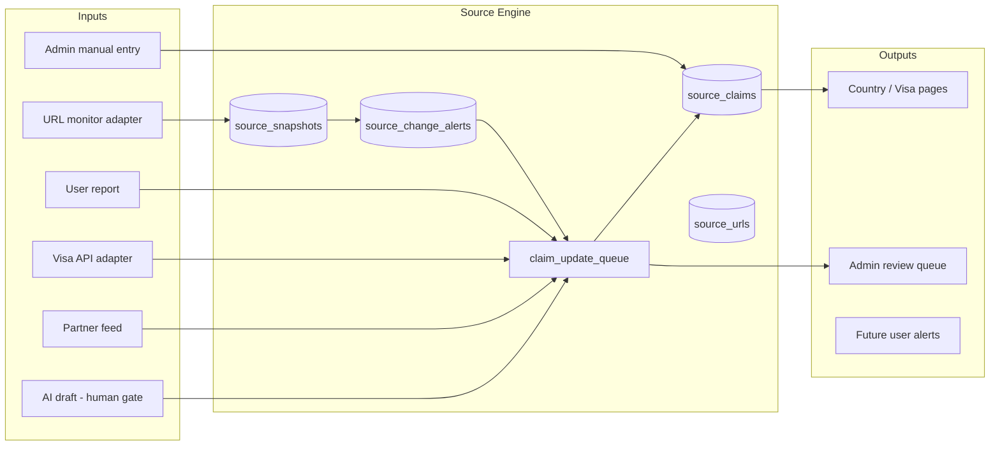

# Expat Atlas — Source Verification System

**Mission:** Every material claim about visas, residency, property, insurance, or costs must be traceable, reviewable, and honestly uncertain when appropriate.

This is not optional infrastructure. It is the product's trust layer.

---

## Core Concepts

| Concept | Definition |
|---------|------------|
| **Claim** | A single factual or planning statement shown to users |
| **Source** | URL or named authority backing a claim |
| **Confidence** | How sure we are the claim is still accurate |
| **Review status** | Editorial/admin workflow state |
| **Risk level** | User harm if claim is wrong |

---

## Claim Schema

```typescript
interface SourceClaim {
  id: string;
  country_id?: string;
  visa_option_id?: string;
  city_id?: string;
  category: ClaimCategory;
  claim_text: string;              // internal precise wording
  plain_english_summary: string;   // user-facing
  source_url: string;
  source_type: SourceType;
  source_name: string;             // e.g. "Philippines Bureau of Immigration"
  last_checked_at?: string;        // automated or manual check
  last_verified_at?: string;       // human verified
  last_changed_at?: string;
  confidence_level: 'low' | 'medium' | 'high';
  review_status: ReviewStatus;
  reviewed_by?: string;
  expires_review_at?: string;      // re-review due date
  risk_level: 'low' | 'medium' | 'high';
  is_user_visible: boolean;
  requires_professional_review: boolean;
  notes?: string;                  // admin only
  created_at: string;
  updated_at: string;
}
```

### Claim categories

`visa_stay_length`, `visa_fees`, `visa_documents`, `visa_work_rights`, `visa_extension`, `property_ownership`, `property_lease`, `tax_residency`, `healthcare_access`, `cost_of_living`, `safety_general`, `internet_reliability`, `marriage_implications`, `family_dependents`, `insurance_requirement`, `passport_requirement`, `editorial_summary`

### Source types

| Type | Weight |
|------|--------|
| `official_government` | Highest |
| `embassy_consulate` | Highest |
| `immigration_authority` | Highest |
| `licensed_professional` | High (partner-reviewed) |
| `partner_provided` | Medium (must be verified) |
| `third_party_data` | Medium-low |
| `editorial` | Low (opinion/planning) |
| `user_report` | Unverified until reviewed |

### Review statuses

| Status | Meaning | User visibility |
|--------|---------|-----------------|
| `draft` | Work in progress | Hidden |
| `needs_review` | Not yet verified | Hidden or banner |
| `auto_detected` | Monitor flagged change | Hidden pending review |
| `human_reviewed` | Admin approved | Visible |
| `partner_reviewed` | Licensed partner confirmed | Visible |
| `deprecated` | Superseded | Hidden + redirect |
| `disputed` | Conflicting reports | Visible with warning |

---

## User-Facing Display Rules

Every legal/visa/property/insurance/tax page **must** include:

1. **Official source link area** — primary + secondary URLs
2. **Last verified date** — or “Not yet verified”
3. **Confidence badge** — low / medium / high
4. **Disclaimer** — general planning information only
5. **Report outdated info** button
6. **Expert referral placeholder** — “Get expert review” → waitlist
7. **Admin review status** — visible to admins only

### Copy templates

**High confidence, recently verified:**
> Last verified March 2026 · Official source · General planning information — confirm with authorities before acting.

**Low confidence / needs review:**
> Planning estimate · Needs verification · This may be worth researching. Verify with the official source.

**High risk:**
> Legal review recommended · Do not rely on this alone for property or immigration decisions.

---

## Source Monitoring Architecture



### Tables

| Table | Purpose |
|-------|---------|
| `source_urls` | Canonical URLs under watch |
| `source_snapshots` | Content hash + metadata per fetch |
| `source_change_alerts` | Detected changes |
| `claim_update_queue` | Pending claim edits from any adapter |

**MVP:** Manual admin entry + user reports only. Adapter interfaces stubbed.

---

## Adapter Interface (packages/source-engine)

```typescript
interface SourceAdapter {
  name: string;
  fetch(url: string): Promise<SnapshotResult>;
  detectChanges(prev: Snapshot, next: Snapshot): ChangeSet;
  proposeClaimUpdates(changes: ChangeSet): ClaimPatch[];
}

// Registered adapters (MVP: manual only)
const adapters = {
  manual: ManualAdapter,
  // url_monitor: UrlMonitorAdapter,      // Phase 3+
  // visa_api: VisaApiAdapter,            // Future
  // partner_feed: PartnerFeedAdapter,    // Phase 4+
  // user_report: UserReportAdapter,      // Phase 3
  // ai_draft: AiDraftAdapter,            // Future
};
```

**Do not** implement fragile scraping as the only source of truth.

---

## User Report Flow

1. User clicks “Report outdated info” on claim or visa card
2. Form: what seems wrong, optional source URL, email (if logged out)
3. Creates `source_change_alerts` or `reported_info` admin item
4. Related claims → `review_status = disputed` or flag
5. Admin resolves: update claim, deprecate, or reject report
6. Audit log entry

---

## Admin Workflows (`/admin/source-claims`)

| Action | Effect |
|--------|--------|
| Create claim | `draft` |
| Publish | `human_reviewed` + set `last_verified_at` + `expires_review_at` |
| Deprecate | `deprecated`; hide from users |
| Set confidence | Updates badge |
| Link official URL | Creates/updates `source_urls` |
| Acknowledge alert | Alert → `acknowledged` |
| Bulk re-review | Filter `expires_review_at < now()` |

### Re-review SLA (recommended)

| Risk level | Re-verify every |
|------------|-----------------|
| High | 30 days |
| Medium | 90 days |
| Low | 180 days |

---

## AI Expat Coach Integration

When AI references factual claims:

1. Query `source_claims` by country/visa/category
2. Cite claim ID + source name in UI
3. If no claim or `confidence_level = low`, say uncertainty explicitly
4. Refuse to state “you qualify” or “this is legal”
5. High-risk topics → `requires_professional_review` → show referral CTA

**MVP:** Coach UI without live LLM; rules-based responses only.

---

## Seed Data Policy

All initial visa/cost/property data:

- `review_status = needs_review` OR `human_reviewed` only after founder entry
- `confidence_level = low` unless official URL attached
- `demo_data = true` on country seed where appropriate
- Real government URLs preferred even if content not yet verified

---

## Metrics

| Metric | Purpose |
|--------|---------|
| Claims with official source % | Trust coverage |
| Avg days since last_verified | Freshness |
| Open alerts count | Admin workload |
| User reports / month | Community signal |
| Disputed claims | Risk hotspot |

---

## Implementation Files (Phase 3)

```
packages/source-engine/
├── src/
│   ├── types.ts
│   ├── adapters/
│   │   ├── manual.ts
│   │   └── base.ts
│   ├── claims/
│   │   ├── queries.ts
│   │   └── badges.ts
│   ├── queue/
│   │   └── processor.ts
│   └── index.ts
```
