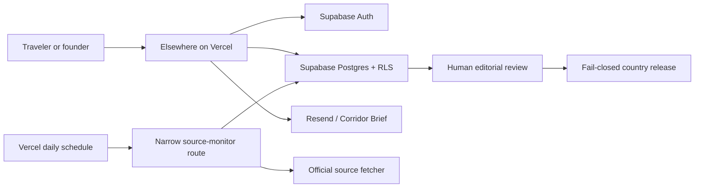

# Elsewhere production status and next build

**Updated:** July 16, 2026
**Canonical repository:** `ltvaughan19/elsewhere-app`
**Canonical branch:** `main`
**Production:** `https://elsewhereplan.com`

## Executive status

Elsewhere now has a real production foundation, not just a landing page. The
marketing experience, public country field guides, personal planning app,
Supabase account/data layer, staff editorial desk, publishing controls, and
official-source monitoring architecture live in one repository and one deployed
Next.js application.

The platform foundation is live. The factual relocation product is deliberately
not yet populated: no country claims or guidance blocks have passed the evidence,
review, and release process, so the public country portals remain honest previews.

## How the system works

- Vercel builds and serves the single Next.js application and custom domain.
- Supabase Auth creates and refreshes user sessions through secure cookies.
- Supabase stores profiles, user-owned plans, newsletter consent, editorial
  records, immutable evidence/release history, and monitoring state.
- Row-level security limits traveler data to its owner. Staff and publishing
  actions require separate authorization inside guarded database functions.
- The planned source worker can only claim and complete fetch jobs. It cannot
  author, review, suppress, resolve, or publish guidance.
- Public country pages read only eligible current releases. If review or
  evidence freshness fails, guidance does not render.

## Production inventory

The production project is healthy on Supabase Postgres 17. Nine repository
migrations are applied in order. Every public table currently reports row-level
security enabled.

Current production counts:

| Area | Current state |
|---|---:|
| Auth users | 1 |
| Profiles | 1 |
| Cloud-saved plans | 1 |
| Active Corridor Brief subscribers | 1 |
| Active staff memberships | 1 |
| Countries | 3 |
| Portal sections | 33 |
| Claim categories | 16 |
| Published releases | 0 |
| Published claims / blocks | 0 / 0 |
| Source documents / evidence snapshots | 0 / 0 |
| Enabled monitor configurations / jobs | 0 / 0 |

The Philippines ledger contains 109 researched government-first URLs in the
repository. Those URLs are staging inventory, not database evidence and not
published advice.

## Environment-variable model

No secret values belong in Git. Vercel should hold production values and local
development should use an ignored `.env.local` file.

| Purpose | Variables | Exposure |
|---|---|---|
| Application origin | `NEXT_PUBLIC_APP_URL` | Public |
| Browser/server Supabase client | `NEXT_PUBLIC_SUPABASE_URL`, `NEXT_PUBLIC_SUPABASE_PUBLISHABLE_KEY` | Public by design; RLS remains mandatory |
| Trusted server writes | `SUPABASE_SECRET_KEY` | Server only |
| Corridor Brief | `RESEND_API_KEY`, `RESEND_FROM_EMAIL`, `RESEND_AUDIENCE_ID` | Server only |
| Source-monitor schedule | `CRON_SECRET` | Server only |
| Narrow monitor identity | `SUPABASE_SOURCE_MONITOR_WORKER_JWT` | Server only, expiring, role must be exactly `source_monitor_worker` |
| Optional monitor tuning | `SOURCE_MONITOR_BATCH_SIZE` | Server only |
| Optional analytics | `NEXT_PUBLIC_POSTHOG_KEY`, `NEXT_PUBLIC_POSTHOG_HOST` | Public |

Production authentication and cloud plan sync are functioning, which confirms
the public Supabase connection is active. Exact Vercel secret presence still
needs a signed-in dashboard inventory. Source monitoring is not activated: its
database configuration and job queue are empty, and the dedicated worker
credentials have not been verified or drilled.

## Remaining work

### P0 — production safety and account completeness

1. Inventory Vercel variables without exposing their values; rotate any legacy
   keys and prefer Supabase publishable/secret keys.
2. Provision a short-lived `source_monitor_worker` JWT and `CRON_SECRET`, then
   run baseline, changed-source, failure, and recovery drills on one harmless
   official source.
3. Enable Supabase leaked-password protection.
4. Add password recovery, email verification/resend, sign-out, session/device
   controls, and an explicit distinction between guest and cloud-synced plans.
5. Establish backup/restore testing, alerting, error monitoring, and an incident
   process before meaningful user volume.
6. Record an explicit disposition for the four intentional authenticated
   `SECURITY DEFINER` staff functions currently flagged by the Supabase advisor.

### P1 — turn research inventory into trusted guidance

1. Select a narrow Philippines launch slice—entry, extensions, and one long-stay
   pathway are the recommended first corridor.
2. Capture exact evidence snapshots from selected official sources.
3. Draft atomic claims with applicability, effective dates, user meaning, and
   direct citations.
4. Complete source verification plus professional review for immigration, tax,
   healthcare, employment, and other high-risk claims.
5. Assemble and approve the first release; only then expose factual guidance.
6. Repeat the evidence process for Thailand and Mexico rather than copying a
   Philippines-shaped template.

### P1 — finish the traveler operating system

1. Turn the research path into a dated, editable move timeline with dependencies.
2. Replace planning estimates and seed comparisons with reviewed country data.
3. Add saved-source watchlists, change alerts, and “what changed for my plan.”
4. Build realistic budget scenarios with currency timestamps and assumptions.
5. Add household, dependents, pets, work, business, and citizenship/residence
   context to applicability decisions.
6. Add account export/deletion, notification preferences, accessibility testing,
   localization foundations, and conflict-safe multi-device plan syncing.

### P2 — commercial and operational scale

1. Integrate real billing and entitlement enforcement; pricing is currently
   informational and Stripe is not connected.
2. Build verified professional profiles, credential renewal, conflicts,
   suppression, referral disclosure, and partner lead tracking.
3. Complete legal/privacy review before paid acquisition, partner referrals, or
   sensitive-document handling.
4. Establish analytics consent, conversion funnels, lifecycle email, support,
   correction SLAs, editorial staffing, and country-expansion economics.

## Product truth

Elsewhere is production-shaped but not content-complete or commercially mature.
The architecture is designed to scale safely; the next major milestone is not
more placeholder UI. It is the first small, fully evidenced, professionally
reviewed Philippines release and the operating discipline required to keep it
current.
