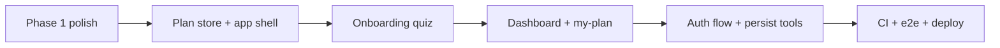

# GStack Today Execution Plan — Expat Atlas

**Date:** 2026-06-30  
**Mode:** Office Hours recap → CEO HOLD SCOPE → Execute Phases 1 exit + 2 MVP  
**Branch:** `main`  
**Live:** https://expat-atlas-web.vercel.app

---

## Reality check: what "finish" means today

The full roadmap is **7 phases (~18 weeks)**. Finishing *everything* (mobile, admin, community, partners pipeline, source engine CRUD) in one day is not possible without violating trust rules (fake data, skipped admin).

**Today's finish line (GStack CEO HOLD SCOPE):** A user can complete the **"Build My Expat Plan"** wedge end-to-end on the public site:

1. Land on a polished marketing site  
2. Compare countries + use budget/passport tools  
3. Sign up (demo or Supabase when configured)  
4. Complete readiness quiz  
5. See personalized dashboard with next step + 30-day outline  
6. Persist checklist and budget in their plan  

**Explicitly deferred (not today):** Live Stripe, AI coach RAG, verified partners, community matching, Expo mobile, document vault, production admin CRUD.

---

## Status snapshot

### Phase 1 — ~95% complete

| Done | Remaining |
|------|-----------|
| 25 routes, build passes, Vercel deploy | Lighthouse pass (target ≥80) |
| Compare, visa compass, pricing, tools | Mobile nav + sticky CTA |
| Legal pages, trust, SEO sitemap | OG/social metadata per route |
| 6 Playwright smoke tests | GitHub Actions CI |
| Globe hero (CSS, not Three.js) | Landing scroll polish (P2) |
| 9 country seeds | PH/TH/MX depth on country pages |
| Marketing stubs | Housing/property/insurance **education** pages |
| | Partner application **form** (validation exists) |
| | Report outdated info intake |

### Phase 2 — 0% (critical path today)

| Task | Priority |
|------|----------|
| Plan store (localStorage + Supabase-ready) | P0 |
| `/app` layout shell (sidebar, mobile) | P0 |
| `/app/onboarding` readiness quiz | P0 |
| `/app/dashboard` readiness + next step | P0 |
| `/app/my-plan` 30-day template | P0 |
| `/app/budget`, `/app/passport` (persisted) | P0 |
| `/app/saved`, `/app/settings` | P1 |
| Signup/login → onboarding flow | P0 |
| Supabase Auth wiring (when env set) | P1 — needs user credentials |

### Phase 3–7 — backlog

Source admin, partner pipeline, community, mobile, full QA CI — **post-MVP sprints**.

---

## Today's sprint order

### Sprint A — Phase 1 exit (2–3h)
- Mobile navigation
- Sticky mobile CTA on landing
- Education content: housing, property, insurance
- Partner application form
- Report outdated info on country pages
- GitHub Actions: build + typecheck

### Sprint B — App wedge (4–6h)
- `lib/plan-store.ts` + readiness scoring
- `app/app/*` routes and layout
- Onboarding quiz (10 questions, PH/TH/MX fit)
- Dashboard with demo readiness score
- Wire signup → onboarding → dashboard

### Sprint C — Ship (1h)
- Extend Playwright for onboarding path
- Build verify, commit, push, Vercel QA

---

## Blockers requiring you

| Blocker | Action |
|---------|--------|
| Supabase not configured | Create project at supabase.com → copy URL + anon key to `apps/web/.env.local` + Vercel env |
| Real email auth | Requires Supabase; demo mode works without it today |

---

## Trust rules (unchanged)

- No fake verified partners
- No "you qualify" visa language
- All estimates labeled planning/demo
- No legal advice as final authority

---

*GStack synthesis for 2026-06-30 work session.*
