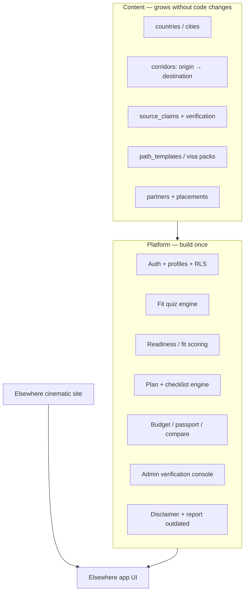

# Elsewhere — Foundation Charter

**Brand:** Elsewhere  
**Date:** 2026-07-13  
**Status:** Locked direction (CEO SELECTIVE EXPANSION)  
**Product line (internal):** Expat transition OS — public name is **Elsewhere**

---

## 1. The core insight (your concern, answered)

You are right to fear this trap:

> Start with 2 countries → hardcode everything → later expansion forces a rewrite.

The fix is **not** “launch 40 countries on day one.”  
The fix is **ship narrow content on a wide platform.**

| Layer | Day-1 strategy | Why it scales |
|-------|----------------|---------------|
| **Content / corridors** | Few published, deep, verified | Trust + quality; avoid hollow encyclopedia |
| **Data model** | Country-agnostic from day one | Adding Mexico = rows + claims, not new tables |
| **Product modules** | Built as plugins (quiz, path, checklist, budget…) | Same UX for every corridor |
| **Trust / legal** | Source ledger + disclaimers + RBAC first | Compliance scales with content volume |
| **Security** | Auth, RLS, encryption architecture before vault | You earn trust before asking for documents |

**Rule:** Never encode “Portugal” or “Philippines” into schema or business logic. Encode **corridors**, **claims**, **path templates**, and **verification status**. Content is data. Platform is code.

---

## 2. Mission

**Elsewhere turns the pressure to move abroad into one calm, trustworthy path.**

We exist so people who feel burned out, priced out, or ready for a different life do not drown in forty tabs, contradictory forums, and guru certainty. We give structure, verified avenues, honest costs, and a clear next step — without pretending to be their lawyer, accountant, or immigration officer.

### Mission test (every feature)

If this page cannot answer **“What do I do next?”** with honesty and a safer next step, it is not ready.

---

## 3. Vision (10-year)

Elsewhere becomes the **default infrastructure** for ethical relocation:

1. Planning OS for individuals  
2. Verified partner network (attorneys, housing, insurance — never faked)  
3. Official-source ledger the industry trusts  
4. Community cohorts that reduce loneliness without unsafe stranger matching  
5. Optional human-assisted concierge when the user is ready  

We do not become a travel blog, a visa mill, or a property marketplace that hides risk.

---

## 4. Values (non-negotiable)

| Value | Behavior |
|-------|----------|
| **Clarity over volume** | Prefer one verified claim over ten scraped opinions |
| **Calm over hype** | No “guaranteed visa,” no fear funnels, no bro-nomad energy |
| **Honesty about limits** | Always: planning estimates; verify with official / licensed sources |
| **Trust before monetization** | No fake partners; label demo, affiliate, sponsored |
| **User protection** | Minimal data; no passport file vault until encryption architecture ships |
| **Scalable craft** | Content is data; corridors are configuration; rebuilds are failure |
| **Dignity** | Users are adults under pressure — not leads to harvest |

---

## 5. Brand & naming strategy

### Public brand
**Elsewhere** — emotional, adult, memorable. Owns the feeling of “a life that fits somewhere else.”

### Product naming (marketing-aligned)

| Layer | Name | Use |
|-------|------|-----|
| Company / brand | **Elsewhere** | Logo, domain, ads, social |
| Marketing site | Elsewhere | Cinematic landing, waitlist |
| Product app | **Elsewhere** (or “Elsewhere Path”) | Quiz, dashboard, plan |
| Internal OS codename | Expat Atlas / FarHome | Engineering docs only — retire from UI |
| Feature modules | Path, Fit Quiz, Checklist, Vault, Compass | Lowercase product language |

### SEO / discoverability

Do **not** hide expat/relocation keywords. Elsewhere is brand; search still needs plain language:

- “move abroad plan,” “expat checklist,” “digital nomad visa research,” country + corridor pages  
- Brand = Elsewhere; category language = relocation / expat / long-stay  

### Tagline options (pick one in design review)

1. *One calm path abroad.*  
2. *From pressure to a clear path.*  
3. *The quiet center for people ready to leave.*  

---

## 6. Who we serve (and who we don’t)

### Primary (build for these)

1. **Pressure movers** — burnout, cost of living, readiness — not tourists  
2. **Remote / income-flexible adults** exploring legal long-stay options  
3. **First-time planners** who need sequence, not more articles  

### Secondary (support, don’t optimize first)

4. Family / partner movers  
5. Future property researchers (education only)  

### Explicitly not first

- Tour booking engine  
- Unverified housing marketplace  
- “We’ll get you approved” immigration sales  

---

## 7. Platform architecture principle (scalability guarantee)

### Scalability contracts (must not break)

1. **Country = row**, not a route hardcode  
2. **Corridor = origin_country + destination_country + metadata**  
3. **Visa / path = versioned pack** with `last_reviewed_at`, `confidence`, `source_claim_ids`  
4. **Quiz answers → scoring adapter** that reads corridor packs (not if/else per country)  
5. **Partner / sponsor = status machine** already designed — never invent verified humans  
6. **i18n-ready strings** even if English-only at launch  
7. **Feature flags / plan tiers** as metadata — Stripe later  

If a feature requires “special case for Portugal,” it fails the architecture review.

---

## 8. Priority structure (what we build in what order)

### Priority 0 — Foundation (now)
*Makes future content cheap and safe*

| # | Workstream | Outcome |
|---|------------|---------|
| P0.1 | Brand unification to **Elsewhere** | One name in UI, docs, domains plan |
| P0.2 | Canonical data model (corridors, claims, path packs) | Expand countries without migrations panic |
| P0.3 | Trust + legal skeleton | Disclaimers, privacy, terms, report-outdated |
| P0.4 | Security baseline | Auth, RLS, secrets, no sensitive file vault yet |
| P0.5 | Admin verification console (minimal) | Humans can publish claims safely |

### Priority 1 — Wedge product (next)
*Useful and obvious for a real user*

| # | Workstream | Outcome |
|---|------------|---------|
| P1.1 | Marketing site (cinematic Elsewhere) | Demand + waitlist |
| P1.2 | Fit quiz → Path → Checklist | Elsewhere-app pattern, generalized |
| P1.3 | Budget + passport tools | Immediate practical value |
| P1.4 | **2–3 published corridors** (deep, verified-enough) | Ecosystem seed without hollow breadth |

**Recommended first corridors (LOCKED for v1):**  
**US → Philippines · US → Thailand · US → Mexico**

Rationale: hotspot expat communities, similar affordability bands for many US planners, already partially seeded. Portugal and others remain schema-compatible later.

See `BUSINESS_PLAN_AND_LAUNCH_REPORT.md` and `BUILD_CHECKLIST.md`.

### Priority 2 — Trust moat
| # | Workstream |
|---|------------|
| P2.1 | Full source engine + watchlist |
| P2.2 | Partner application → verification queue |
| P2.3 | Sponsored/affiliate disclosure system |
| P2.4 | Compliance review (privacy, marketing claims, jurisdiction) |

### Priority 3 — Network effects
| # | Workstream |
|---|------------|
| P3.1 | Moderated cohorts / community |
| P3.2 | Field reports (moderated) |
| P3.3 | Concierge waitlist → human assist |

### Priority 4 — Scale surfaces
| # | Workstream |
|---|------------|
| P4.1 | Many corridors (content ops, not eng rewrite) |
| P4.2 | Mobile app (shared packages) |
| P4.3 | Live subscriptions / Stripe |
| P4.4 | AI coach **only** with RAG over verified claims |

---

## 9. Business plan (architecture-ready)

### Value proposition
Elsewhere is the **calm operating system** for people under pressure to move abroad: fit clarity, a researched path, checklists, and trustworthy next steps.

### Revenue streams (order of introduction)

| Phase | Stream | Trust constraint |
|-------|--------|------------------|
| Early | Free tool + waitlist → email nurture | No fake scarcity |
| Near | Subscription (Explorer / Builder) | Pay for structure, not “approvals” |
| Mid | Serious Move one-time plan | Clear deliverable = plan pack |
| Mid | Verified partner lead referrals | Only `verified` partners; disclosure |
| Later | Sponsored placements | Always labeled sponsored |
| Later | Concierge / human assist | Licensed referrals; no legal practice by Elsewhere |
| Deferred | Affiliates (insurance, housing tools) | Labeled; never override editorial scoring |

### Unit of value
Not “article views.”  
**Completed plans:** quiz finished → path saved → checklist progress → return visits.

### Go-to-market (ground-up brand)

1. Own the cinematic brand story (marketing site)  
2. Convert waitlist → Fit Quiz  
3. SEO corridor pages only when claims are structured  
4. Content marketing = “what to do next” guides linked to source ledger  
5. Partner outreach only after verification pipeline works  

### Competitive position

| Competitor type | Elsewhere difference |
|-----------------|----------------------|
| Travel blogs | Structure + next steps + verification |
| Visa consultants | Self-serve clarity first; referral later |
| Nomad Facebook groups | Calm, moderated, no chaos as product |
| Generic AI chat | Claims with sources; refuse final authority |

---

## 10. Trust, law, and security (worthy of what we ask)

### Trust architecture
- Every visa/legal/cost claim → `source_claims` with URL, type, confidence, review status  
- UI shows confidence + last verified + “report outdated”  
- Never: “you qualify,” “guaranteed,” “approved,” “best attorney”  
- Demo / needs_review / sponsored always labeled  

### Legal / compliance posture (build toward; counsel confirms)
- Privacy Policy + Terms live before collecting emails beyond waitlist  
- GDPR-minded: consent, export, delete, minimal collection  
- Relocation data is sensitive — treat profiles as high-care  
- No unauthorized practice of law / immigration consultancy  
- Marketing claims review before paid ads  
- Jurisdictional counsel before handling EU personal data at scale  

### Security baseline (Priority 0)

| Control | When |
|---------|------|
| Supabase Auth + RLS on all user tables | Before any real accounts |
| Service role key server-only | Now |
| No passport/ID file uploads | Until vault architecture + encryption design |
| Admin MFA + audit log | Before admin console goes live |
| Secrets in env / Vercel — never git | Now |
| Dependency + CI security checks | With CI |
| CSO / security review skill | Before production personal data |

### Document vault rule
**Not MVP.** Metadata checklists only until a written encryption + threat model exists.

---

## 11. Content ops model (how the ecosystem grows without rebuilds)

1. **Path pack** authored for a corridor (JSON/DB)  
2. Claims linked and marked `needs_review` or `human_reviewed`  
3. Admin publishes corridor (`is_published`)  
4. Quiz scoring picks packs by answer tags — no code deploy required  
5. Compare / country cards read same tables  

**Content team scales the product. Engineering scales the platform.**

---

## 12. Success metrics

| Horizon | Metric |
|---------|--------|
| 30 days | Waitlist + quiz completion rate; 1–2 corridors published with claim metadata |
| 90 days | Returning users on checklist; zero fake-partner incidents; RLS live |
| 12 months | N corridors added **without schema rewrite**; first verified partner; paid tier test |

---

## 13. Skills to call by stage

| Stage | Skills / workflows |
|-------|-------------------|
| **Now — Foundation** | `gstack-office-hours` ✅ · `gstack-plan-ceo-review` ✅ · `gstack-plan-eng-review` · `supabase-postgres-best-practices` · `gstack-cso` (threat model draft) |
| **Brand / marketing site** | `gstack-plan-design-review` · `frontend-design` · `scroll-experience` · `threejs-interaction` · `taste-skill` |
| **App / quiz / path** | `gstack-autoplan` · `react-best-practices` · `gstack-plan-eng-review` |
| **Trust / source engine** | Existing `SOURCE_VERIFICATION_SYSTEM.md` · admin UX · `gstack-careful` |
| **Security / compliance** | `gstack-cso` · `gstack-guard` · privacy counsel (human) |
| **Pre-launch QA** | `gstack-qa` · `playwright-best-practices` · `webapp-testing` |
| **Ship** | `gstack-review` · `gstack-ship` · `deploy-to-vercel` |
| **Later AI coach** | Only after claims RAG — refuse until then |

---

## 14. Immediate build sequence (next 4 engineering sprints)

1. **Rename / brand pass** — Elsewhere in app chrome; retire Expat Atlas from user-facing UI  
2. **Unify repos** — Marketing (Vite/Spline) + App (Next) under one monorepo `elsewhere`  
3. **Canonical schema** — corridors, path_packs, source_claims, quiz_answer_schema  
4. **Port elsewhere-app quiz** into Next as the Fit Quiz engine (data-driven)  
5. **Security** — Supabase Auth + RLS; waitlist emails with consent  
6. **Publish 2 corridors** with real claim metadata (or honest `needs_review`)  
7. **Admin verify queue** — minimum viable trust console  

---

## 15. Decision log (locked today)

| Decision | Choice |
|----------|--------|
| Brand | **Elsewhere** |
| First corridors | **US → PH · TH · MX** |
| Architecture ambition | **Wide platform** |
| Content launch | **Narrow, deep corridors** |
| Mode | **CEO SELECTIVE EXPANSION** — expand foundation, hold hollow breadth |
| Commercial | **Freemium; paid tiers later** |
| Fake partners | Forbidden |
| Document vault | Deferred until encryption architecture |
| AI legal advice | Forbidden as authority |

---

## 16. One-sentence operating principle

> **Build the house so fifty countries can move in without remodeling — then invite the first few guests carefully.**

---

*This charter supersedes conflicting name guidance in older Expat Atlas docs for product direction. Migrate docs in a follow-up pass.*
