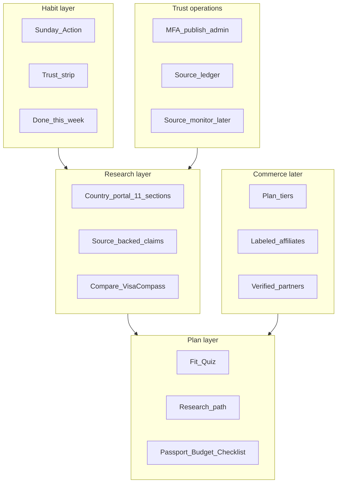
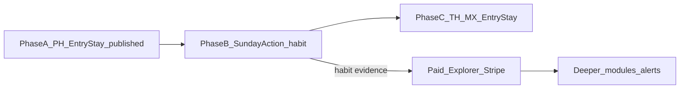

# Elsewhere — Full Current Business Plan

**Document type:** Master business plan (product + commercial + GTM + constraints)  
**Brand:** Elsewhere  
**Domain (production):** https://elsewhereplan.com  
**Repo:** https://github.com/ltvaughan19/elsewhere-app (local clone often `expat-atlas`)  
**Version:** 2026-08-06  
**Audience:** Founder, advisors, and external models (e.g. Grok) tasked with income-scale planning  
**Status:** Authoritative snapshot of *current locked strategy + shipped reality*. Older companions remain useful history: [`BUSINESS_PLAN_AND_LAUNCH_REPORT.md`](./BUSINESS_PLAN_AND_LAUNCH_REPORT.md), [`ELSEWHERE_FOUNDATION.md`](./ELSEWHERE_FOUNDATION.md), [`PRODUCT_CLARITY_MAP.md`](./PRODUCT_CLARITY_MAP.md), [`docs/CURRENT.md`](../CURRENT.md).

---

## How to use this document with Grok (or any strategist)

1. Paste **this entire file** as the source of truth.  
2. Instruct the model: **do not invent verified partners, guaranteed visas, or “you qualify” language; do not treat forums as legal authority; do not propose revenue that requires fake trust.**  
3. Ask it to expand **§19 Desired income model** into a concrete plan (ARPU, conversion, corridor economics, hiring, content ops) while preserving **§0 North star** and **§8 Trust constraints**.  
4. Treat **§2 Current state** as *what exists today*; treat **§4–7 Product & monetization** as *intended architecture*; treat gaps between them as the build backlog, not as shipped features.

---

## 0. North star (locked — non-negotiable)

> **“I’m actually going — and I know the one thing to do before Sunday.”**

**Leaving is the metric.** Research tools, quizzes, content shelves, community, AI, and paid features are justified only when they increase the probability that a real person takes a trustworthy real-world action this week.

### Core weekly habit (product definition of success)

1. **One next action** this week (doable, concrete).  
2. **Official-source touch** when the action depends on a factual rule (government / immigration / embassy page).  
3. **Human signal** when accountability or belonging helps (later; not required for v1 wedge).

### Strategic edge (locked 2026-07-22)

Compete on **certainty + time-to-first-real-action**, not on “AI answers,” content volume, or guru certainty.

**Sunday Action UX pattern** (required on every serious surface):

1. One primary next action (doable this week).  
2. Trust strip (source / freshness / not legal advice).  
3. Done this week? (user marks complete).  
4. Evidence boundary (what this supports — and does **not**).

**Corridors, not brochures.** A corridor is a life-event path (e.g. **US → Philippines · Entry & legal stay**), not a country wiki.

**Reality is the moat.** Official pages authorize claims only after **human-attested capture → review → MFA publish**. AI may discover URLs, draft UI, and stage packages; AI may **not** invent stay lengths, nationality lists, fees, or eligibility.

### CEO operating covenant

Builders must challenge failure-shaped requests: disconnected tool drawers, vanity engagement, premature ecosystem/community, unsupported authority, or work that delays learning whether users leave. The owner retains final authority after the conflict and safer alternative are stated.

---

## 1. One-sentence company definition

**Elsewhere** is a **trust-first expat transition operating system (OS)** that turns verified research into one doable weekly action for people under pressure to move abroad — without acting as a lawyer, accountant, immigration consultant, or visa mill.

| We are | We are not |
|--------|------------|
| Relocation planning OS | Travel blog |
| Corridor research + weekly leaving habit | “Guaranteed visa” service |
| Official-source ledger with honesty badges | Scraped-as-truth encyclopedia |
| Pipeline for *future* verified partners | Fake attorney / landlord marketplace |
| Freemium structure product | Paid-only fear funnel |

**Public promise (marketing):** *One calm path abroad — structure, verified research avenues, and a clear next step.*

**Category language (SEO):** move abroad plan, expat checklist, long-stay / digital nomad visa *research*, country + corridor pages. Brand = Elsewhere; category = relocation / expat / long-stay.

---

## 2. Current state (honest — as of 2026-08-06)

### What is live in production

| Surface | State |
|---------|--------|
| Marketing site | Live at elsewhereplan.com (Spline Earth locked; self-hosted scene) |
| Auth | Supabase Auth (email/password + Google); continuous session across marketing / research / planner |
| Philippines country portal | **Release 1 published** — Entry & legal stay: `next_action` + claims A–C + sources ledger |
| Other PH portal sections | Scaffold / “In review” (honest empty) |
| Thailand / Mexico portals | Structure live; **not** MFA-published Entry/Stay depth like PH |
| Fit Quiz / `/app/*` plan tools | Live; plan syncs to `user_plans` when signed in |
| Dashboard Sunday Action | Wired to **published PH** `next_action` + trust strip + “done this week?” (ISO week in plan JSON) |
| Pricing page | Tier **UI** live — **Stripe checkout not live** |
| Partners | Application form + empty / pending states — **zero invented verified partners** |
| Admin publishing | Solo MFA publisher path (AAL2) for country releases; source self-attest for solo operator |
| Corridor Brief / research email | Waitlist / research email path as live capture |

### What is explicitly not live

- Stripe billing / enforced paid gates on product surfaces  
- Source-monitor worker that auto-stales and requires re-attest (schema exists; habit-first sequencing parks it)  
- AI Expat Coach as authority on visas  
- Verified partner directory with real humans  
- Document vault (passport/ID file storage)  
- Community / Skool as core product  
- Full 11-section content for PH / TH / MX  

### Operating model today

| Role | Reality |
|------|---------|
| Publisher | Founder / designated staff with MFA — **solo-operator model** |
| Content truth | Human opens official URL → captures attested snapshot → narrow claim → review → pin → MFA publish |
| AI / agents | Cursor = control tower; Codex = briefed units only; never invent `.gov` facts |
| Verification capacity | **Primary bottleneck** (not hosting cost) |

---

## 3. Market problem & ICP

### Problem (jobs to be done)

**From:** “I want to live abroad but I don’t know what’s legal, safe, realistic, or affordable — and forums contradict each other.”  
**To:** “I know my best corridor options, a research path, a budget runway, risks I must verify officially, and the **one thing to do before Sunday**.”

Hidden needs: confidence, structure, risk reduction, official-source clarity, financial realism, human connection (later), next steps, warnings — **not more blogs**.

### Ideal customer profile (ICP) — primary

1. **Pressure movers** — burnout, cost-of-living pressure, readiness to leave — not tourists.  
2. **Remote / income-flexible adults** exploring lawful long-stay options.  
3. **First-time planners** who need sequence more than articles.

### Secondary (support, don’t optimize first)

4. Family / partner movers.  
5. Future property researchers (**education only** — rent first, buy later).

### Explicit non-customers (for now)

- Tour booking shoppers.  
- People seeking “we’ll get you approved.”  
- Speculative property buyers expecting transaction facilitation.  
- Users wanting unmoderated stranger matching.

### Personas (product language)

| Persona | Need |
|---------|------|
| First Passport Dreamer | Passport + courage path |
| Isolated Life Rebuilder | Reset + lower COL + structure |
| Budget-Conscious Long-Stay Traveler | Visa + rent realism |
| Future Property Buyer | Due diligence education, not deals |
| Family / Marriage Planner | Dependents, schools, implications |
| Remote Worker / Digital Nomad | Internet, visa legality, **tax caution** (no residency determinations) |

### Launch corridors (locked v1)

| Corridor | Why |
|----------|-----|
| **US → Philippines** | Anchor; English; retiree / expat presence; COL band; **first published wedge** |
| **US → Thailand** | Nomad / long-stay research density; SEA peer |
| **US → Mexico** | Closest major US corridor; large expat cities; Americas peer |

**Not v1:** Portugal / EU (different cost/FX/complexity band). Architecture supports adding corridors as **data**, not schema rewrites.

---

## 4. Full product scope (what Elsewhere provides)

### 4.1 Product layers



### 4.2 Country portal taxonomy (navigation truth — 11 sections)

Fill **in corridor order**, never as a bulk wiki dump:

| Priority | Section | Free publish bar (intent) |
|----------|---------|---------------------------|
| 0 | Entry and legal stay | Live on PH Release 1 |
| 1 | Overview and fit | Thin: watchouts + Sunday Action + Fit Quiz CTA |
| 2 | Money and affordability | 1–2 sourced planning claims + budget CTA |
| 3 | Housing | Rent-first watchouts; no broker marketplace |
| Later | Healthcare, work/tax, safety, moving, living | Same evidence pipeline after habit proof |
| Always | Sources / corrections | Ledger visible |

### 4.3 Capability catalog (full intended OS)

| # | Capability | User outcome | Monetization stage |
|---|------------|--------------|--------------------|
| 1 | Calm marketing + waitlist | Feel understood; join list | Acquisition |
| 2 | Fit Quiz → readiness hypothesis | “Which corridor first?” | Free |
| 3 | Corridor research path + checklist | Ordered next decisions | Free |
| 4 | Published Sunday Action | One official next step this week | Free (habit wedge) |
| 5 | Done-this-week persistence | Accountability loop | Free; **history/streak = Paid** |
| 6 | Country portals + claims | Source-backed research | Free for published modules |
| 7 | Compare destinations | Side-by-side planning | Free basic; full = Paid |
| 8 | Visa Compass | Labeled visa research cards | Free with confidence labels |
| 9 | Passport checklist | Metadata readiness (no ID uploads) | Free |
| 10 | Budget / runway calculator | Planning estimates | Free basic; depth = Paid |
| 11 | Saved countries + cloud plan | Continuity across devices | Paid continuity |
| 12 | Change alerts (source stale) | Re-verify when official pages change | Paid (after monitor worker) |
| 13 | 30/60/90 Serious Move pack | Time-boxed action plan | One-time paid |
| 14 | Housing / insurance education hubs | Rent-first / coverage categories | Free education → affiliate later |
| 15 | Partner referrals | Licensed help when stuck | After verification; lead fees |
| 16 | Concierge intake | Human-assisted planning | High-touch; waitlist → paid |
| 17 | Community cohorts | Belonging without unsafe matching | Later; not v1 wedge |
| 18 | Mobile (Expo) | Same OS on phone | Phase later |
| 19 | Encrypted document vault | Secure docs | Deferred until encryption architecture |
| 20 | AI coach | Assist over **cited claims only** | Builder+; never final authority |

### 4.4 How we provide it (delivery system)

| Mechanism | Description |
|-----------|-------------|
| **Platform** | One Next.js App Router app + one Supabase project (auth, Postgres, RLS). Monorepo: `apps/web`, `packages/*`. |
| **Content-as-data** | Countries, corridors, portal sections, claims, content blocks, releases — not hardcoded country apps. |
| **Editorial pipeline** | Official URL → human snapshot (SHA-256 evidence) → narrow claim + citation → review notes → pin to release → **MFA publish**. |
| **Publication states** | Draft / ready / published; preview vs public; `needs_review` honesty badges. |
| **Sunday Action engine** | Published `next_action` blocks surface on portal + dashboard. |
| **Plan store** | Guest localStorage; authenticated `user_plans` JSON (includes `sundayActionProgress`). |
| **Partner status machine** | `draft` → `pending_verification` → `verified` / `rejected` / `suspended` / `sponsored` / `demo` — never auto-approve. |
| **Affiliate / sponsor slots** | Schema + UI slots built; fill only with disclosure. |

---

## 5. Free vs paid value ladder (commercial architecture)

### Principle

**Free must feel complete for Stage 0 → leaving habit.**  
**Paid sells continuity, depth, and priority** — never “you are approved for a visa,” and never wall the *only* useful page before habit proof.

### Free (must ship as a coherent product)

- Browse **published** corridor content (PH Entry/Stay today; expand only via MFA releases).  
- One **Sunday Action** with trust strip + “done this week?”  
- Fit Quiz / basic plan scaffolding in `/app`.  
- Passport checklist, basic budget, Visa Compass / compare as **helpers that point back to Sunday Action**.  
- Optional MFA framed as **account security** (never staff publication language).  
- Corridor Brief waitlist / research email.

### Paid — Explorer-first (charge when habit exists)

**Intended Explorer (~$12/mo) — continuity + research depth**

- Saved Sunday Action **history** + streak / “what I did”  
- Saved countries + **plan continuity** across devices (beyond guest local)  
- **Change alerts** when published sources go stale (after source-monitor worker)  
- Full comparison + deeper modules **when those modules are actually published**  
- Corridor Digest (paid research brief) — as messaging on pricing

**Intended Builder (~$29/mo) — roadmap depth**

- Everything in Explorer  
- Personalized move roadmap  
- Housing strategy module / insurance hub (education → later affiliates)  
- Advanced checklists  
- AI Expat Coach (**beta**, claim-cited only; refuse legal final authority)

**Serious Move (~$149 one-time)**

- Focused 30/60/90 action pack for one corridor  
- Risk checklist + savings target + country recommendation **report** (planning estimates)

**Concierge (waitlist → notify)**

- Human-assisted planning intake  
- Verified expert referrals **when available**  
- Priority support  

### Explicitly not Free and not next (parked until habit + trust capacity)

- AI coach as primary product  
- Fake partners  
- Full 11-section wiki for vanity completeness  
- Community / Skool as the growth engine  
- Document vault  

### Pricing page metadata (live UI — provisional)

| Tier ID | Display price | Period | Checkout |
|---------|---------------|--------|----------|
| `free` | $0 | forever | N/A |
| `explorer` | $12 | / month | **Not live** |
| `builder` | $29 | / month | **Not live** |
| `serious_move` | $149 | one-time | **Not live** |
| `concierge` | Notify me | — | Waitlist |

`plan_tier` exists on profiles; **feature gates are not yet the primary enforcement layer** for paid continuity features.

---

## 6. Revenue model (streams)

| Stream | Mechanism | Timing | Trust constraint |
|--------|-----------|--------|------------------|
| **Subscription (SaaS)** | Explorer / Builder monthly | After Free habit proof + Stripe | Never sell approvals |
| **One-time pack** | Serious Move | Parallel or after Explorer | Planning reports only |
| **Concierge** | High-touch intake fee | After verified capacity | Licensed referrals only |
| **Affiliate** | Insurance, eSIM, VPN, flights, banking, gear | After education hubs | Labeled affiliate; editorial independence |
| **Partner directory** | Directory subscription + sponsored placements | After verification pipeline | Disclosure on every sponsored slot |
| **Qualified leads** | Lead requests to verified partners | After verified partners exist | Consent + corridor + need type |
| **Marketplace (future)** | Bookings / housing leads | Late | No fake inventory; scam education first |

**Primary early revenue thesis:** Freemium → Explorer conversion from users who already have a weekly leaving habit and want **continuity + alerts + depth**.

**Primary cost thesis:** Elsewhere wins or loses on **human verification capacity**, not server bills — until vault/AI token burn.

---

## 7. Unit economics scaffold (for Grok to complete)

> Founder planning scaffold — **not a forecast**. Fill numbers in §19.

| Variable | Definition | Notes |
|----------|------------|-------|
| **CAC** | Cost to acquire a Free activated user (completed Fit Quiz + saw Sunday Action) | Organic-first early |
| **Activated Free** | Can state “Before Sunday I will ___” after using Free | North-star activation |
| **Habit rate** | % who mark done and return next week | Leading indicator for paid |
| **Free→Explorer CVR** | Paid conversion among habit users | Charge habit users, not tourists |
| **ARPU** | Blended monthly revenue / paying user | Explorer vs Builder mix |
| **Gross margin** | Revenue − variable (payments, email, support, affiliate payouts) | High SaaS margin until concierge |
| **Content COGS** | Hours × loaded cost to MFA-publish one portal section | Bottleneck |
| **LTV** | ARPU × months − churn | Sensitive to source freshness trust |
| **Payback** | CAC / (ARPU × gross margin) | Target &lt; 3–6 months later stage |

**Corridor P&L intuition:** Each new corridor multiplies **verification load** before it multiplies revenue. Prefer depth on PH → habit → paid test → TH/MX Entry/Stay — not three hollow encyclopedias.

---

## 8. Trust, legal, and risk constraints (hard rails)

### Never (as final authority)

Legal, immigration, tax, insurance, medical, investment, or real estate advice.  
Never say: “you qualify,” “guaranteed visa,” “approved,” “safe investment,” “best attorney” (unless truly verified and disclosed).

### Always

- Planning estimates; verify with official / licensed sources  
- Source / confidence / last-verified metadata (or `needs_review`)  
- Demo / affiliate / sponsored labels  
- “Report outdated information” where factual claims show  

### Partner statuses (public vocabulary)

| Status | User-facing |
|--------|-------------|
| `demo` | Demo listing |
| `pending_verification` | Partner verification pending |
| `verified` | Verified partner |
| `sponsored` | Sponsored · Verified (disclosure) |
| empty | Verified partners coming soon |

### Top risks (see `RISK_REGISTER.md`)

1. Users treat Elsewhere as legal authority.  
2. Outdated visa / source data.  
3. Fake trust (invented partners).  
4. AI hallucination on visa facts.  
5. Single-founder verification bottleneck.  
6. Premature document vault / data breach.  

### MVP data boundary

No passport/ID **file** storage. Checklist metadata only until encrypted vault architecture ships.

---

## 9. Go-to-market & marketing strategy

### Positioning

| Axis | Elsewhere | Typical competitor failure |
|------|-----------|----------------------------|
| Certainty | Official-source + human attest | Forum certainty / guru certainty |
| Time | One action before Sunday | Endless reading |
| Tone | Calm, adult, dignified | Hype / fear / bro-nomad |
| Scope | Corridors | Fake global encyclopedia |

### Brand tone

Calm, direct, human, trustworthy. Copy examples: “Here is the safer next step.” “Verify before acting.” “Rent first. Buy later.”

### Acquisition strategy (phased)

**Phase A — Soft brand / demand**

- Cinematic landing + waitlist / Corridor Brief email  
- SEO foundation on corridor pages **only when claims are structured**  
- Organic: founder narrative, LinkedIn / communities (education, not spam)

**Phase B — Product-led growth (habit)**

- Warm users (5–10) on Free PH + dashboard Sunday Action  
- Success signal: can state “Before Sunday I will ___”; some mark done; some return  
- Iterate wedge before paid ads

**Phase C — Corridor SEO + content ops**

- Publish Entry/Stay (then Money/Housing) per corridor via MFA  
- “How to research X visa” pages that terminate in Sunday Action, not blog rabbit holes

**Phase D — Paid acquisition (only after trust UX + habit)**

- Search / social ads to Free activation, not to “guaranteed visa” claims  
- Retarget users who completed quiz but did not mark weekly done  
- Never buy traffic into unverified high-risk claims

**Phase E — Partners & affiliates**

- Verified partner leads once directory is real  
- Labeled affiliates on insurance / connectivity / travel tools  

### Channels (priority order)

1. Product-led (quiz → Sunday Action → return)  
2. Email / Corridor Brief  
3. SEO corridor + trust pages  
4. Founder-led warm outreach  
5. Community presence (education; Skool/community product later)  
6. Paid ads (after habit metrics)  
7. Partner co-marketing (after verification)

### Messaging hierarchy (CTAs)

1. Primary: **Build my expat plan** / Start Fit Quiz / This week’s Sunday Action  
2. Secondary: Compare countries  
3. Tertiary: Passport checklist  

---

## 10. Launch & build sequencing (ruthless)



| Phase | Goal | Exit signal |
|-------|------|-------------|
| **A** | PH Entry/Stay MFA-published | Done (Release 1) |
| **B** | Weekly Sunday Action habit with warm users | Users can state next action; some return |
| **C** | TH/MX Entry/Stay via same pipeline | Second/third corridors trustworthy |
| **D** | Explorer monetization test | Stripe + gates; CVR among habit users |
| **E** | Alerts, deeper modules, partners | Source monitor + verified humans |

**Veto:** Filling all portal shelves / building Meta-community / AI coach **before** Phase B evidence.

---

## 11. Competitive landscape (strategic)

| Archetype | Offer | Elsewhere differentiation |
|-----------|-------|---------------------------|
| Travel / expat blogs | Articles | Action + sources + weekly habit |
| Visa mills / agents | Sales + filings | We **do not file**; we research + plan |
| Nomad Facebook groups | Anecdote | Official-source moat; calm UX |
| Generic AI chat | Instant answers | Cited claims only; refuse eligibility |
| Relocation consultants | High-touch $ | Self-serve OS first; Concierge later |
| Country tourism boards | Promotion | Planning realism + risk honesty |

**Moat thesis:** Human-attested official-source ledger + Sunday Action habit UX + corridor OS architecture — compounding as corridors grow **without** rewriting the platform.

---

## 12. Operations & org model

### Near-term (solo / tiny)

| Function | Owner |
|----------|-------|
| Product / MFA publish | Founder |
| Engineering | Founder + AI agents (Cursor control tower) |
| Claim capture | Founder (human eyes on official pages) |
| Support | Self-serve next steps + email later |
| Legal review | External counsel for ToS/privacy/marketing claims |

### Later (after revenue)

| Function | Trigger to hire / contract |
|----------|----------------------------|
| Country / corridor editors | Habit + paid; verification backlog |
| Partner verification ops | First real partner cohort |
| Support / success | Paying user volume |
| Compliance | Ads + partners + multi-jurisdiction |

**Designated country reps come after revenue** — do not block Phase A/B on them.

---

## 13. Technology stack (approved)

> **Full tech plan:** [`ELSEWHERE_TECHNICAL_ARCHITECTURE.md`](./ELSEWHERE_TECHNICAL_ARCHITECTURE.md)  
> (as-built monorepo, auth/MFA, editorial publish pipeline, data model, deploy, locks).  
> This section is the short commercial summary only.

| Layer | Choice |
|-------|--------|
| Web | Next.js App Router, TypeScript, Tailwind, shadcn/ui |
| Monorepo | pnpm + Turborepo (`apps/web` live; Expo later) |
| Backend | Supabase Postgres + Auth + RLS; Drizzle mirror in `packages/db` |
| Trust core | Editorial releases → `published_*` views; MFA (AAL2) publish |
| Validation | Zod (`packages/validation`) |
| Source helpers | `packages/source-engine` |
| Payments | Stripe-ready abstraction — **checkout not live** |
| Analytics | PostHog (intended) |
| Email | Resend / webhooks for waitlist (as configured) |
| Motion | Framer Motion; Spline Earth self-hosted + checksum-locked |
| Mobile | Responsive web first; Expo later |
| QA | Playwright, Vitest, `pnpm check:guardrails` / `check:release` |

**Infra cost bands (order of magnitude, USD/mo):** Soft $0–20 → App+Auth $20–75 → Growth $75–250 → Scale content $250–800+ → Vault/AI material jump (defer).

---

## 14. Key metrics (north-star aligned)

### Product

| Metric | Why |
|--------|-----|
| Sunday Action completion (done this week) | Leaving habit |
| Return next week | Habit retention |
| Official-source click-through | Real-world touch |
| Fit Quiz → path completion | Activation |
| Outdated-info reports handled | Trust ops health |

### Business

| Metric | Why |
|--------|-----|
| Waitlist / email growth | Demand |
| Free→Explorer CVR (among habit users) | Monetization quality |
| Churn / LTV | Continuity value |
| Claims published per month | Supply constraint |
| Partner applications → verified | Ecosystem readiness |

### Anti-metrics (do not optimize as ends)

Pageviews alone, time-on-site, quiz completions without real-world action, tool count, “countries launched” without MFA depth.

---

## 15. Financial sketch (founder planning)

| Cost center | Soft | App live | Growth |
|-------------|------|----------|--------|
| Hosting (Vercel/Supabase) | Low | Low–med | Med |
| Email / analytics | Low | Low | Med |
| Founder verification time | **Highest** | Highest | Hire |
| Legal counsel | As needed | Ongoing | Ongoing |
| Ads | Optional later | After habit | Scale carefully |
| Partner commissions | — | — | % of leads |
| AI tokens | Avoid early | Guardrails | Monitor |

**Cash posture:** Prefer organic + product-led until Free habit is proven; do not burn ads into unverified authority.

---

## 16. Decision log (locked)

| Decision | Choice |
|----------|--------|
| Public brand | **Elsewhere** |
| Product type | Expat transition OS |
| North star | Leaving / Sunday Action |
| Launch corridors | US → PH, TH, MX |
| Commercial model | Freemium; paid after habit |
| Truth model | Human-attested official sources + MFA publish |
| Partners | Pipeline now; verified humans later |
| Document vault | Deferred |
| AI coach | Later; claim-cited; never final authority |
| Community product | Later; not Phase B blocker |
| One site / one auth | Locked |

---

## 17. Open founder decisions (business)

| # | Decision | Blocks |
|---|----------|--------|
| 1 | Final Stripe prices / annual discount | Monetization launch |
| 2 | Legal entity name on contracts / footer | B2B partners, Stripe |
| 3 | Counsel pass on Privacy / Terms / marketing claims | Ads + email scale |
| 4 | First paid cohort size / invite rules | Explorer beta |
| 5 | Desired income target & timeline (fill §19) | Grok expansion |
| 6 | Whether to deepen PH before TH/MX Entry/Stay | Content ops sequence |
| 7 | Affiliate categories to enable first | Rev share |

---

## 18. Document map (source corpus)

| Doc | Role |
|-----|------|
| **This file** | Full current business plan for founder + Grok |
| `docs/plans/ELSEWHERE_TECHNICAL_ARCHITECTURE.md` | Full technical architecture (stack, data, publish, deploy) |
| `docs/CURRENT.md` | Day-to-day engineering / product truth |
| `docs/plans/PRODUCT_CLARITY_MAP.md` | North star + site map |
| `docs/plans/ELSEWHERE_FOUNDATION.md` | Platform scalability charter |
| `docs/plans/BUSINESS_PLAN_AND_LAUNCH_REPORT.md` | July 2026 launch report (superseded in parts by this file) |
| `PARTNER_STRATEGY.md` | Partner statuses & slots |
| `SOURCE_VERIFICATION_SYSTEM.md` | Claim / confidence rules |
| `RISK_REGISTER.md` | Risks & mitigations |
| `ROADMAP.md` | Phase checklist (may lag CURRENT) |
| `PROJECT_BRIEF.md` | Original brief (Expat Atlas naming history) |

---

## 19. Desired income model — INPUTS FOR GROK EXPANSION

> **Founder: fill the targets below before or inside the Grok prompt.**  
> Grok must expand this section into a full income plan **without violating §0 or §8**.

### Founder targets (fill in)

| Input | Value (fill) |
|-------|----------------|
| Target monthly net income (personal) | $________ |
| Target company MRR / ARR | $________ / $________ |
| Timeline to that income | ____ months |
| Max founder hours/week on verification | ____ |
| Willingness to hire editors | Y/N · budget $____/mo |
| Geography of customers (assume) | Primarily US-origin planners? ____ |
| Capital for ads | $____/mo starting month ____ |
| Acceptable Free→Paid CVR assumption | ____% |
| Acceptable monthly churn | ____% |

### Required Grok deliverables

1. **Revenue bridge:** Free users → habit users → Explorer / Builder / Serious Move / Concierge mix to hit target MRR.  
2. **Funnel math:** Traffic → activated Free → weekly done → paid; with sensitivity tables.  
3. **Corridor economics:** Cost to publish Entry/Stay (+ next sections) vs expected ARPU per corridor.  
4. **Pricing recommendation:** Affirm or revise $12 / $29 / $149 with justification vs willingness-to-pay for *continuity + alerts*, not visa approval.  
5. **12-month operating plan:** Hiring, content ops, when to turn on Stripe, when to enable affiliates/partners.  
6. **Risk-adjusted forecast:** Best / base / worst; what kills trust and therefore LTV.  
7. **What not to build** to hit income faster (explicit kill list aligned with north star).  
8. **Marketing calendar:** Organic + email + SEO + (optional) paid, sequenced after habit metrics.

### Hard constraints Grok must obey

- No revenue plan that requires inventing verified partners or “you qualify” ads.  
- No plan that walls the only useful Free Sunday Action behind pay before habit proof.  
- No plan that treats “launch 40 countries” as the path to income.  
- Prefer **depth on corridors + habit + paid continuity** over encyclopedia vanity.  
- Call out when founder verification capacity makes a forecast impossible.

### Suggested Grok prompt (paste after this file)

```
You are a strategic business advisor. Using the Elsewhere Full Current Business Plan
as the ONLY product/truth source, build an income-scale plan to hit my targets in §19.

Preserve the north star (leaving / Sunday Action), freemium ladder, trust rails,
and solo MFA publishing bottleneck. Do not invent legal authority or fake partners.

Output: executive summary, funnel math, pricing critique, 12-month roadmap,
hiring plan, corridor sequence, kill list, and three forecast scenarios.
Flag any place my income target conflicts with verification capacity or trust rules,
and propose the smallest trustworthy path that still aims at the income goal.
```

---

## 20. Executive summary (one page)

Elsewhere is building the default **ethical relocation OS**: corridor research grounded in **human-attested official sources**, converted into a **weekly Sunday Action** so people under pressure to leave can say *“I’m actually going — and I know the one thing before Sunday.”*

**v1 corridors:** US → Philippines, Thailand, Mexico.  
**Shipped wedge:** Philippines Entry & legal stay (Release 1) + Free dashboard Sunday Action + done-this-week.  
**Monetization:** Freemium; Explorer/Builder/Serious Move priced in UI; Stripe not live; charge for **continuity, history, alerts, and published depth** after habit proof.  
**Moat:** Reality (official-source ledger) + habit UX + scalable corridor data model.  
**Bottleneck:** Human verification / MFA publish capacity — not hosting.  
**Next commercial move:** Prove weekly leaving habit with warm Free users → then Stripe Explorer → then TH/MX Entry/Stay and deeper modules.

---

*Update this document when pricing, entity, corridor set, or north-star metrics change. Day-to-day engineering truth remains `docs/CURRENT.md`.*
