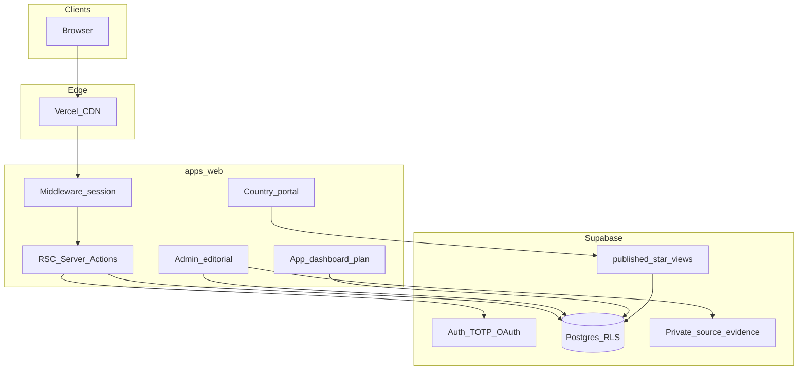
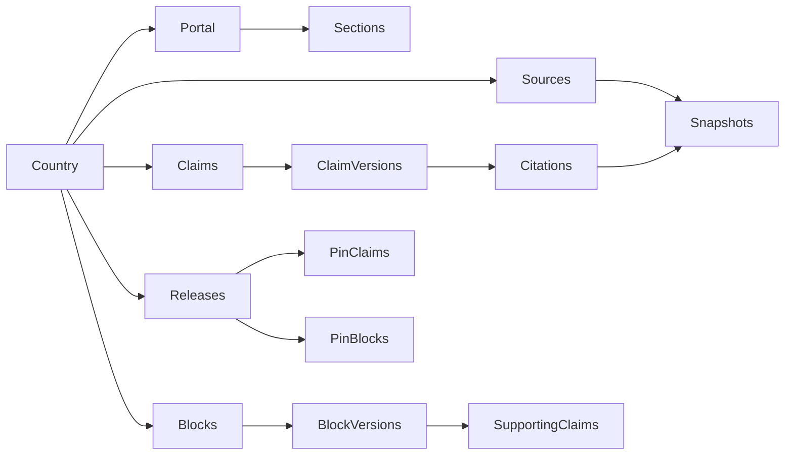
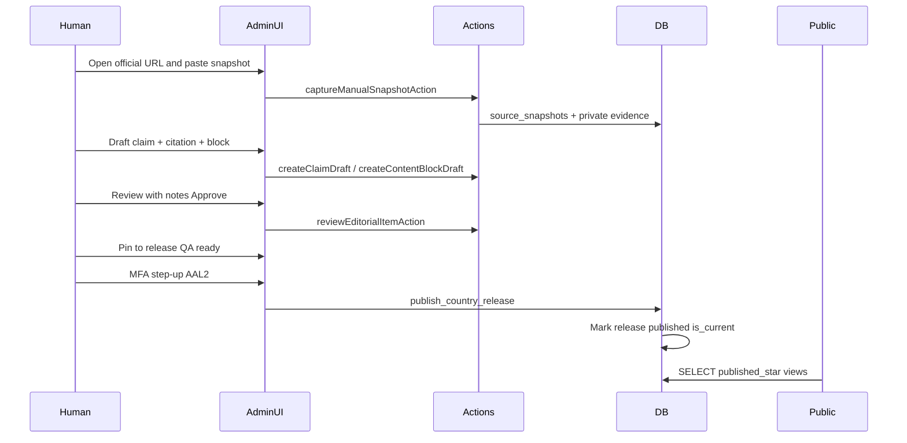

# Elsewhere — Technical Architecture (Full Stack)

**Document type:** Technical system plan (engineering + architecture + ops)  
**Brand:** Elsewhere · **Production:** https://elsewhereplan.com  
**Version:** 2026-08-06  
**Companion:** [`ELSEWHERE_FULL_BUSINESS_PLAN.md`](./ELSEWHERE_FULL_BUSINESS_PLAN.md) (commercial) · root [`ARCHITECTURE.md`](../../ARCHITECTURE.md) (earlier overview; this file is the **current as-built + intended** tech plan)  
**Audience:** Founder, engineers, and models (e.g. Grok) that need to reason about scale, cost, and build sequence without inventing product truth.

---

## How to use with Grok

Paste **this file + the business plan**. Instruct Grok:

- Treat **§2 As-built** as what exists today.  
- Treat **§10 Intended / deferred** as backlog, not shipped.  
- Do not propose scrapers that publish without human MFA.  
- Do not assume Stripe, Expo mobile, or verified partners are live.  
- Respect Earth/Spline **locks** and quality gates.

---

## 1. System thesis (one paragraph)

Elsewhere is a **single Next.js web application** backed by **one Supabase project** (Auth + Postgres + RLS + private evidence storage). Public users read **only MFA-published** country portal content via Postgres views. Staff author claims and releases in `/admin` under role + **AAL2 (MFA)** gates. User plans sync via `user_plans` JSON. The platform is **corridor-agnostic** (content is data); the Philippines Entry/Stay release is the first published instance of that pipeline.



---

## 2. As-built reality (2026-08-06)

| Layer | Reality |
|-------|---------|
| Apps on disk | **`apps/web` only** — no `apps/mobile` directory yet |
| Hosting | Vercel production → elsewhereplan.com |
| Database | Supabase Postgres + migrations under `supabase/migrations/` |
| Auth | Email/password + Google; shared session across marketing / research / `/app` |
| Staff | `staff_memberships` roles: `editor` \| `reviewer` \| `publisher` \| `admin` |
| Publish | `publish_country_release` requires publisher/admin **+ MFA (AAL2)** |
| Public PH | Release 1 live via `published_*` views |
| Payments | Stripe Checkout + Portal + webhook → `plan_tier` / `serious_move_purchased_at` (test keys via env) |
| Cron | `/api/cron/source-monitor` scheduled in `vercel.json` (worker maturity = early) |

---

## 3. Monorepo layout

**Tooling:** pnpm workspaces + Turborepo (`package.json`, `turbo.json`).

```
expat-atlas/   (GitHub: elsewhere-app; folder name may stay expat-atlas)
├── apps/
│   └── web/                 # @expat-atlas/web — Next.js App Router (ONLY live app)
├── packages/
│   ├── ui/                  # Shared UI / tokens
│   ├── types/               # Shared TypeScript types (UserPlan, tiers, …)
│   ├── validation/          # Zod schemas
│   ├── db/                  # Drizzle schema mirror of Postgres
│   ├── source-engine/       # Confidence/badge helpers, monitoring helpers
│   └── config/              # Shared tsconfig / Tailwind presets
├── supabase/
│   ├── migrations/          # Authoritative SQL (editorial, RLS, RPCs)
│   └── seed.sql
├── scripts/
│   └── verify-project-guardrails.mjs
└── docs/
```

**Rule:** Shared logic belongs in `packages/*`, not duplicated in a future mobile app.

---

## 4. Application architecture (`apps/web`)

### 4.1 Framework patterns

| Pattern | Use |
|---------|-----|
| React Server Components | Country portal pages, admin pages, dashboard Sunday Action load |
| Client components | Fit Quiz, plan store, Settings MFA, interactive tools |
| Server Actions | Admin editorial mutations (`app/admin/content/actions.ts`) |
| Route Handlers | Auth callback, newsletter, waitlist, outdated reports, cron |
| Middleware | Supabase session refresh (`middleware.ts` → `lib/supabase/middleware.ts`) |

### 4.2 Route map (on disk — flat, not legacy `(marketing)` groups)

| Area | Routes (representative) | Key files |
|------|-------------------------|-----------|
| Marketing | `/`, `/start`, `/about`, `/pricing`, `/trust`, … | `app/page.tsx`, marketing components |
| Research | `/countries`, `/countries/[slug]`, `/corridors`, `/compare`, `/visa-compass` | `lib/country-portals/*`, portal components |
| Tools | `/passport-checklist`, `/budget-calculator`, education stubs | app routes under `app/` |
| Auth | `/login`, `/signup`, `/forgot-password`, `/reset-password`, `/auth/callback` | `lib/supabase/*`, auth components |
| Member app | `/app/dashboard`, `/onboarding`, `/path`, `/my-plan`, `/passport`, `/budget`, `/saved`, `/settings` | `app/app/*`, `lib/plan-store.ts` |
| Admin | `/admin`, `/admin/content`, `/admin/content/[countrySlug]` | `lib/auth/staff.ts`, editorial actions |
| API | `/api/newsletter`, `/api/waitlist`, `/api/reports/outdated`, `/api/cron/source-monitor` | `app/api/*` |

### 4.3 Session continuity (product rule)

Global chrome must not show a static “Log in” without checking the **shared Supabase session**. Root layout uses `AuthSessionProvider` (`components/auth-session-provider.tsx`). Guardrails enforce this class of regression.

---

## 5. Auth, roles, and MFA

### 5.1 Clients

| Client | File | Purpose |
|--------|------|---------|
| Browser | `lib/supabase/client.ts` | Authed user operations, MFA enroll/challenge |
| Server | `lib/supabase/server.ts` | RSC / Server Actions with cookies |
| Public content | anon client in portal queries | Read `published_*` without user session persistence |
| Admin / service | `lib/supabase/admin.ts` | Service role — **server only**, never in client bundles |

### 5.2 Staff authorization

- Table: `staff_memberships` (`user_id`, `role`, `active`)  
- Loader: `lib/auth/staff.ts` → `getStaffSession()` / `requireStaffSession()`  
- Admin layout redirects non-staff away from `/admin`  
- Member Settings receives `isStaff` so Free users never see “staff publish” MFA copy

### 5.3 MFA / AAL

| Concept | Meaning |
|---------|---------|
| AAL1 | Signed in; MFA factor may exist but session not stepped up |
| AAL2 | Authenticator verified for this session |
| Publish gate | DB `publish_country_release` + UI require AAL2 for publishers |
| Member MFA | Optional account security (login / sensitive account actions) |

Helpers: `lib/auth/mfa.ts`, `components/account-security.tsx`, `components/admin-mfa-step-up.tsx`.

### 5.4 Trusted device

Cookie lifetime policy in `lib/auth/trusted-device.ts` (used by browser + middleware clients).

---

## 6. Data model (editorial + product)

### 6.1 Design principle

**Content is data. Platform is code.** Adding Thailand or Mexico = rows + MFA releases, not a new Next.js app or schema rewrite. Do not hardcode country business logic into tables; encode corridors, claims, sections, releases.

### 6.2 Core editorial entities



| Entity | Role |
|--------|------|
| `countries` / `country_portals` / `portal_sections` | Geography + 11-section field guide structure |
| `source_documents` | Official URL + authority level + verification state |
| `source_snapshots` | Human-attested capture; content hash; private evidence path |
| `claims` / `claim_versions` | Versioned factual/planning statements |
| `claim_version_citations` | Link claim version ↔ snapshot + locator + support note |
| `content_blocks` / `content_block_versions` | User-facing modules (`next_action`, `watchouts`, …) |
| `content_block_claims` | Traceability: blocks must cite supporting claim versions |
| `country_releases` | Immutable-ish publish unit (`draft` → `ready` → `published`) |
| `release_*_versions` | Pins of approved versions into a release |
| `editorial_reviews` / `editorial_audit_events` | Review decisions + audit trail |
| `outdated_information_reports` | User “report outdated” intake |
| `staff_memberships` | Staff RBAC |

Drizzle mirror: [`packages/db/src/schema.ts`](../../packages/db/src/schema.ts).  
Authoritative SQL: `supabase/migrations/20260716031330_editorial_publishing_core.sql` (+ hardening, monitoring, self-attest migrations).

### 6.3 Public read model

| View | Consumers |
|------|-----------|
| `published_country_portals` | Portal shell metadata |
| `published_country_claims` | Claim cards |
| `published_country_blocks` | `next_action` / watchouts / etc. |

Loader: `lib/country-portals/queries.ts` → `getCountryPortal(slug)`  
→ prefers published release; falls back to preview fixtures if unset.  
Country pages use ISR-style `revalidate` (e.g. 3600s).

Sunday Action for dashboard: `lib/sunday-action.ts` reads published PH Entry/Stay `next_action` only when `publicationState === "published"`.

### 6.4 User product data

| Store | Schema | Notes |
|-------|--------|-------|
| Guest plan | `localStorage` key `expat-atlas-user-plan` | Device-only |
| Cloud plan | `user_plans.plan` JSONB | Upsert by `user_id` |
| Habit progress | `plan.sundayActionProgress` | ISO week key; **no new table** |
| Profile | `profiles` | email, `plan_tier`, … |

Client API: `lib/plan-store.ts` (`resolvePlan`, `persistPlan`, `completeOnboarding`, …).  
Types: `packages/types` (`UserPlan`, `SundayActionProgress`, `PlanTier`).

### 6.5 Claim categories ↔ portal sections

Categories (e.g. `entry-requirements`, `stay-options`, `editorial-context`) carry `portal_section_slug`. Creating a claim requires section slug to match category — enforces taxonomy integrity in admin actions.

---

## 7. Editorial publish pipeline (tech flow)



**Hard tech rules**

1. No public HTML scrapers as truth.  
2. Blocks require supporting claim version IDs (traceability migration).  
3. Publish RPC checks role + MFA.  
4. Solo operator may self-attest sources (migration `20260731143000_admin_source_self_attest.sql`) with audit flag — still requires human eyes on the page.  
5. AI/agents may stage draft helpers (`lib/editorial/ph-v1.ts`, `ph-overview-v1.ts`) but **must not invent** official page text.

Admin surface: `app/admin/content/[countrySlug]/page.tsx`.

---

## 8. Trust / source-engine package

`packages/source-engine` provides display helpers (confidence, risk, badges) and hooks toward monitoring. **Authoritative verification remains Postgres editorial state + human review**, not an autonomous scraper.

**Future adapters (designed, not all live as truth):** manual entry, URL monitor → stale flag, user report, AI draft pending human approval.

**AI Expat Coach (deferred):** Must cite internal claims, show uncertainty, refuse final legal/tax authority. Not a substitute for `published_*` content.

---

## 9. Front-end / UX engineering constraints

| Concern | Approach |
|---------|----------|
| Design system | `DESIGN.md` / design tokens — do not freestyle |
| Earth / Spline | Self-hosted `apps/web/public/earth/scene.splinecode`; JS loader checksummed |
| Motion | Framer Motion; respect `prefers-reduced-motion` |
| Heavy 3D | Lazy-load; WebGL sleep past hero on mobile (parked polish) |
| Copy tone | Calm; never “you qualify” / “guaranteed” |

### Quality gates

| Command | Purpose |
|---------|---------|
| `pnpm check:guardrails` | Earth checksums, auth continuity, no service-role in client, … |
| `pnpm check:release` | Full release gate before ship |
| Vitest / Playwright | Unit + E2E as configured |

Script: `scripts/verify-project-guardrails.mjs`  
Policy: `docs/operations/QUALITY_GATES.md`, `CLAUDE.md`.

**Owner approval required** to change Earth binary, camera motion, or protected checksums.

---

## 10. Intended / deferred technical work

| Item | Status | Notes |
|------|--------|-------|
| Stripe Customer + Subscription + webhooks | **Step 1 shipped (code)** | Apply migration; add test keys; forward webhooks |
| Feature-flag module | Partial | Pricing tiers in `lib/pricing-tiers.ts` |
| Source-monitor worker maturity | Early | Cron route + monitoring migrations; habit-first sequencing parks “auto-stale UX” |
| Expo mobile app | Not on disk | Reuse `packages/*` when started |
| Encrypted document vault | Deferred | No passport file uploads in MVP |
| PostHog event taxonomy | Intended | Keys in env template |
| RAG AI coach over claims | Deferred | Hallucination risk high (R08) |
| Partner admin queue + placements UI | Partial forms | Status machine designed |
| Multi-region / i18n | Scaffold mindset | English-first |

---

## 11. Environment variables

### Required for core product

```bash
NEXT_PUBLIC_SUPABASE_URL=
NEXT_PUBLIC_SUPABASE_ANON_KEY=          # or NEXT_PUBLIC_SUPABASE_PUBLISHABLE_KEY
SUPABASE_SERVICE_ROLE_KEY=              # or SUPABASE_SECRET_KEY — server only
NEXT_PUBLIC_APP_URL=
```

### Optional / staged

```bash
# Analytics
NEXT_PUBLIC_POSTHOG_KEY=
NEXT_PUBLIC_POSTHOG_HOST=

# Email / waitlist
RESEND_API_KEY=
RESEND_AUDIENCE_ID=
RESEND_FROM_EMAIL=
NEWSLETTER_WEBHOOK=
WAITLIST_WEBHOOK=

# Source monitor cron
CRON_SECRET=
SUPABASE_SOURCE_MONITOR_WORKER_JWT=
SOURCE_MONITOR_BATCH_SIZE=

# Stripe (not live checkout)
STRIPE_SECRET_KEY=
STRIPE_WEBHOOK_SECRET=
NEXT_PUBLIC_STRIPE_PUBLISHABLE_KEY=

# Future AI
ANTHROPIC_API_KEY=

# Maps (optional)
NEXT_PUBLIC_MAPLIBRE_STYLE_URL=
```

**Never commit secrets.** Service role must never appear in client bundles (guardrail).

---

## 12. Deployment & environments

| Env | Web | DB |
|-----|-----|-----|
| Local | `pnpm --filter @expat-atlas/web dev` | Supabase cloud project or local stack |
| Preview | Vercel preview | Shared or branch DB (team choice) |
| Production | Vercel → elsewhereplan.com | Supabase production |

**Vercel:** `apps/web/vercel.json` — install from monorepo root, turbo build filter `@expat-atlas/web`.  
**Cron:** daily hit to `/api/cron/source-monitor` (secured by `CRON_SECRET`).

### Local start (canonical)

```powershell
cd C:\Users\brenden.vaughan\expat-atlas
git pull origin main
pnpm install
pnpm --filter @expat-atlas/web dev
```

---

## 13. Security & privacy (engineering)

| Control | Implementation |
|---------|----------------|
| RLS | User-owned rows (`user_plans`, etc.); public only via `published_*` |
| RBAC | `staff_memberships` + server checks |
| MFA publish | JWT `aal = aal2` in DB function |
| Evidence | Private storage bucket paths; not public CDN truth |
| Validation | Zod on mutations |
| MVP boundary | No ID/passport file vault |
| Audit | `editorial_audit_events` for publish/review |
| CSP / headers | Production hardening as configured |

Threats and mitigations: root [`RISK_REGISTER.md`](../../RISK_REGISTER.md).

---

## 14. Performance strategy

| Technique | Where |
|-----------|--------|
| Dynamic import / lazy Three.js | Landing Earth |
| `prefers-reduced-motion` | Marketing + app |
| `next/image` | Static assets |
| Portal `revalidate` | Country pages |
| Avoid encyclopedia SSR of unpublished shelves | Preview vs published split |

Target (aspirational): LCP &lt; 2.5s mid-tier mobile on marketing home without jank.

---

## 15. Testing & agent workflow

| Layer | Tool |
|-------|------|
| Unit | Vitest (e.g. editorial helpers, `sunday-week`) |
| E2E | Playwright |
| Agents | Cursor = control tower; Codex = pasted unit briefs only |
| Editorial ops packets | `docs/operations/CODEX_*.md`, `PH_*_RELEASE.md` |

Day-to-day truth: [`docs/CURRENT.md`](../CURRENT.md).

---

## 16. Cost drivers (technical)

| Driver | Impact |
|--------|--------|
| Vercel bandwidth + build minutes | Low–med until traffic |
| Supabase DB size + Auth MAUs | Low early; grows with users + snapshots |
| Private evidence storage | Grows with every attested snapshot |
| Cron / monitor jobs | Cheap until many watched URLs |
| AI tokens (future coach) | Can spike — gate tightly |
| **Human verification time** | Dominant “cost” — not a cloud line item |

---

## 17. Scalability contracts (must not break)

1. **Country = row**, not a bespoke codebase.  
2. **Corridor / portal section = configuration + content rows.**  
3. **Visa/path facts = versioned claims** with citations and review state.  
4. **Public users never see draft editorial rows** — only `published_*`.  
5. **Feature entitlements = `plan_tier` metadata** (Stripe later).  
6. **Partners = status machine** — never invent `verified` humans in UI.  
7. **Mobile later consumes the same packages** — no duplicate business logic in web-only modules that should be shared.

If a feature requires “special-case Portugal tables,” it fails architecture review.

---

## 18. Key file index

| Concern | Path |
|---------|------|
| Staff / MFA session | `apps/web/lib/auth/staff.ts`, `mfa.ts` |
| Portal queries | `apps/web/lib/country-portals/queries.ts` |
| Sunday Action | `apps/web/lib/sunday-action.ts`, `sunday-week.ts` |
| Plan persistence | `apps/web/lib/plan-store.ts` |
| Admin actions | `apps/web/app/admin/content/actions.ts` |
| PH packages | `apps/web/lib/editorial/ph-v1.ts`, `ph-overview-v1.ts` |
| Drizzle schema | `packages/db/src/schema.ts` |
| Guardrails | `scripts/verify-project-guardrails.mjs` |
| Pricing metadata | `apps/web/lib/pricing-tiers.ts` |
| Business plan | `docs/plans/ELSEWHERE_FULL_BUSINESS_PLAN.md` |

---

## 19. Grok expansion hooks (tech)

When asked to scale income or product, Grok should also specify:

1. **Verification throughput model** (snapshots/week → releases/month) vs MRR.  
2. When to staff a second publisher vs automate **detect→stale→human re-attest** only.  
3. Stripe webhook + entitlement design that does **not** paywall the Free Sunday Action wedge.  
4. Infra cost curve at 1k / 10k / 100k MAU given snapshot storage.  
5. What **not** to build (scrapers-as-truth, vault, AI legal answers) even if it looks like growth.

---

## 20. One-page tech summary

Elsewhere runs as **one Next.js app on Vercel** + **one Supabase Auth/Postgres**. The trust core is an **editorial graph** (sources → snapshots → claim versions → content blocks → MFA-published releases) exposed publicly only through **`published_*` views**. Members keep plans in **`user_plans` JSON** (including Sunday Action progress). Staff publish under **role + AAL2**. Stripe, Expo, vault, and AI coach remain **intentionally deferred**. The Earth scene and auth-continuity rules are **guardrail-locked**. The bottleneck to scale is **human attestation capacity**, engineered deliberately so the product cannot silently become a fake-authority encyclopedia.

---

*Update when migrations, deploy topology, or publish gates change. Prefer editing this file over letting `ARCHITECTURE.md` drift silently — or sync both.*
