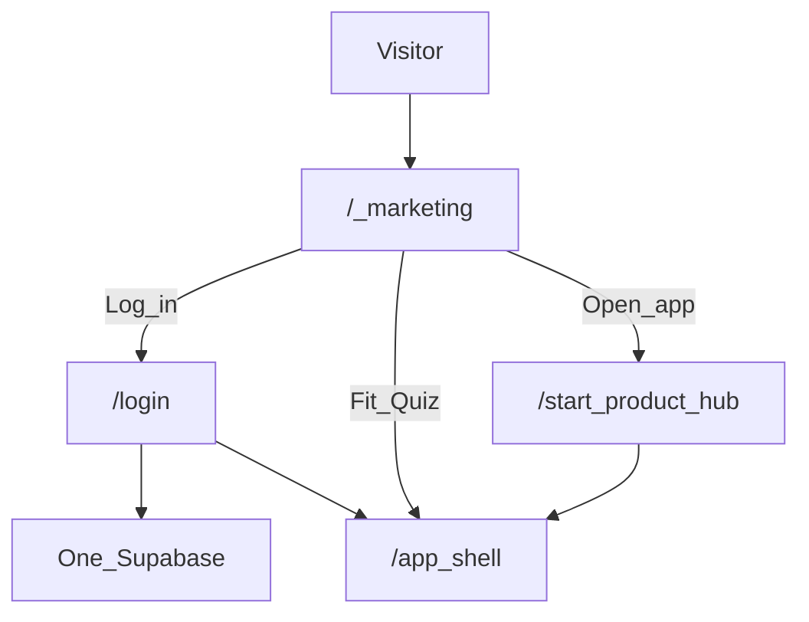

# Elsewhere — One site, one auth (locked)

**Date:** 2026-07-14  
**Decision:** Do the hard consolidate **now**. No “later.”

---

## Locked architecture

| Piece | Decision |
|-------|----------|
| **Repos** | One: `ltvaughan19/elsewhere-app` (this monorepo) |
| **Deploy** | One Vercel project pointed at `apps/web` |
| **Marketing** | Same Next app — route `/` (Spline Earth) |
| **Product** | Same Next app — `/start`, `/app/*`, tools |
| **Auth** | Always completes on **this origin** (`/login`, `/signup`) |
| **Supabase** | **One** project for marketing + product + newsletter prefs + future mobile |

---

## Why not two Supabase projects

Two projects = two user DBs. Landing login would not be app login. Never do that for one brand.

One project: put keys on this Vercel app only. Add redirect URLs for local + production hostnames of **this** site.

---

## Supabase setup checklist (YOU)

1. Create project name e.g. `elsewhere` (only one).  
2. Copy URL + anon key + service role into Vercel + `apps/web/.env.local`.  
3. Auth → URL configuration:
   - Site URL = `https://elsewhereplan.com`
   - Redirect allowlist includes:
     - `http://localhost:3000/**`
     - the exact Vercel preview hostname pattern used by this project
     - `https://elsewhereplan.com/auth/callback`
   - Production email templates must use `{{ .RedirectTo }}` where the flow
     supplies a redirect URL.
   - Configure custom SMTP before relying on signup confirmation or password
     recovery for real users.
4. Do **not** point a second app at a second Supabase.

### Password recovery now implemented

1. `/forgot-password` requests the email with a redirect to
   `/auth/callback?next=/reset-password`.
2. The callback exchanges the one-time code for a cookie-backed session and
   accepts only same-origin paths.
3. Middleware prevents access to the functional reset form without an
   authenticated recovery session.
4. `/reset-password` updates the password and supports password managers and
   pasted generated passwords.

The production Site URL, redirect allowlist, email template, and custom SMTP
must all be verified during rollout. Code alone cannot guarantee email delivery.

---

## Legacy surfaces (retire)

| Old | Action |
|-----|--------|
| elsewhere-mu (Vite) | Archive after this `/` is deployed; optional DNS redirect → this site |
| elsewhere-app-theta quiz | Absorb UX polish later; do not add a second auth |

---

See also: `docs/plans/EMAIL_AND_SUPABASE.md` (Corridor Brief + Resend + plan-gated digest).

---

## Login methods (locked 2026-07-17; Facebook added by owner same day)

**Ship these methods only:**

| Method | Status | Role |
|--------|--------|------|
| Email / password | Live | Always available; no third-party dependency |
| Google | Live | Default for most desktop/Android and ad landers |
| Apple | Code-ready; enable after Developer ownership + secret-rotation owner + renewal date are recorded | iOS trust signal |
| Facebook (Meta) | Code-ready; enable after Meta Developer app + Facebook Login are configured | Meta ads funnel one-tap |

**Do not add** X, LinkedIn, GitHub, TikTok, Discord, or other social logins.

OAuth buttons stay runtime-gated: the UI reads Supabase Auth provider settings and only renders providers that are actually enabled. Facebook uses Supabase’s `facebook` provider (Meta Login).

Owner ops checklist: [`docs/operations/SOCIAL_LOGIN_ACTIVATION.md`](../operations/SOCIAL_LOGIN_ACTIVATION.md).

Trust framing on login/signup: accounts save research and plans; they are not immigration, legal, or government services. Borrow trust from Google / Apple / Facebook marks only—never invent partner badges.

---

## Env vars

See `apps/web/.env.example`.
