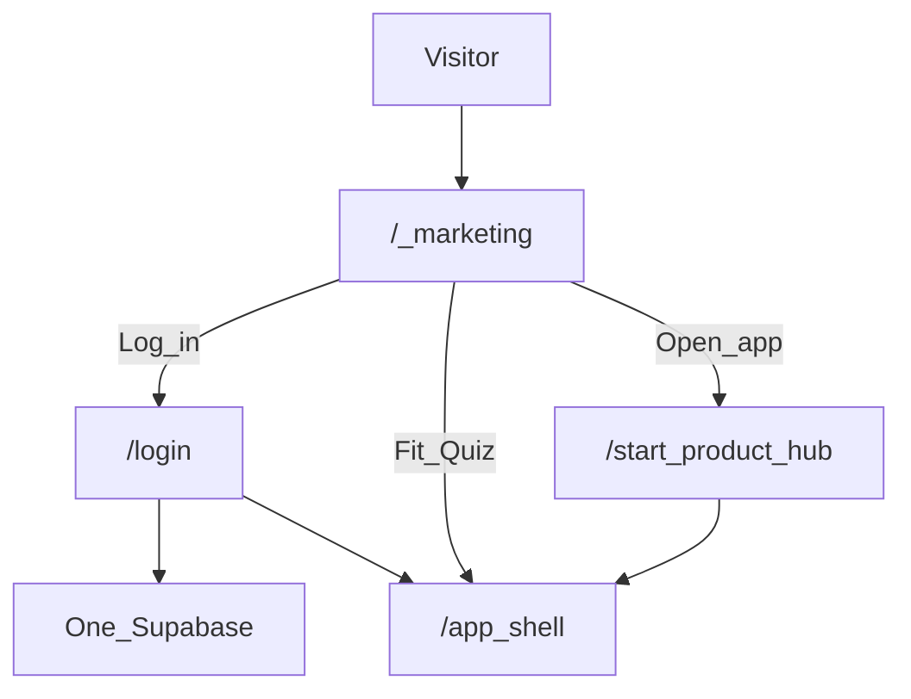

# Elsewhere — One site, one auth (locked)

**Date:** 2026-07-14  
**Decision:** Do the hard consolidate **now**. No “later.”

---

## Locked architecture

| Piece | Decision |
|-------|----------|
| **Repos** | One: `ltvaughan19/elsewhere-app` (this monorepo) |
| **Deploy** | One Vercel project pointed at `apps/web` |
| **Marketing** | Same Next app — route `/` (Spline Earth) |
| **Product** | Same Next app — `/start`, `/app/*`, tools |
| **Auth** | Always completes on **this origin** (`/login`, `/signup`) |
| **Supabase** | **One** project for marketing + product + future mobile |

---

## Why not two Supabase projects

Two projects = two user DBs. Landing login would not be app login. Never do that for one brand.

One project: put keys on this Vercel app only. Add redirect URLs for local + production hostnames of **this** site.

---

## Supabase setup checklist (YOU)

1. Create project name e.g. `elsewhere` (only one).  
2. Copy URL + anon key + service role into Vercel + `apps/web/.env.local`.  
3. Auth → URL configuration:
   - Site URL = `NEXT_PUBLIC_APP_URL` (prod domain when ready)
   - Redirect allowlist includes:
     - `http://localhost:3000/**`
     - `https://<your-vercel-host>/**`
     - later `https://elsewhere.com/**` (single domain)
4. Do **not** point a second app at a second Supabase.

---

## Legacy surfaces (retire)

| Old | Action |
|-----|--------|
| elsewhere-mu (Vite) | Archive after this `/` is deployed; optional DNS redirect → this site |
| elsewhere-app-theta quiz | Absorb UX polish later; do not add a second auth |

---

## Env vars

See `apps/web/.env.example`.
