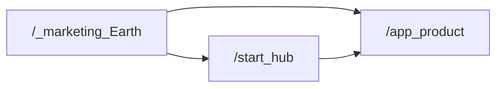
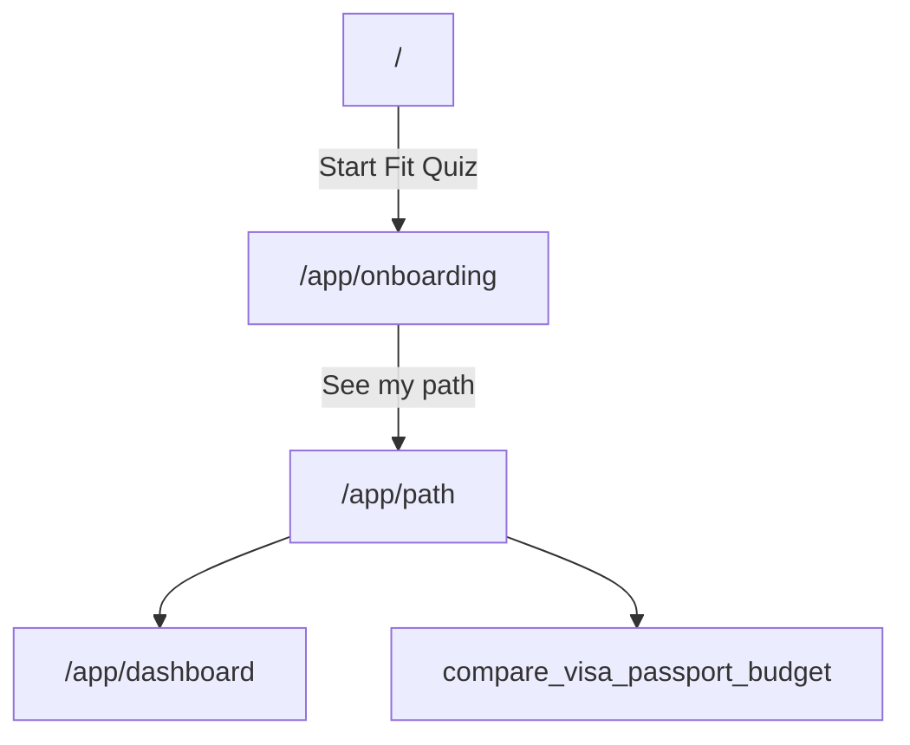
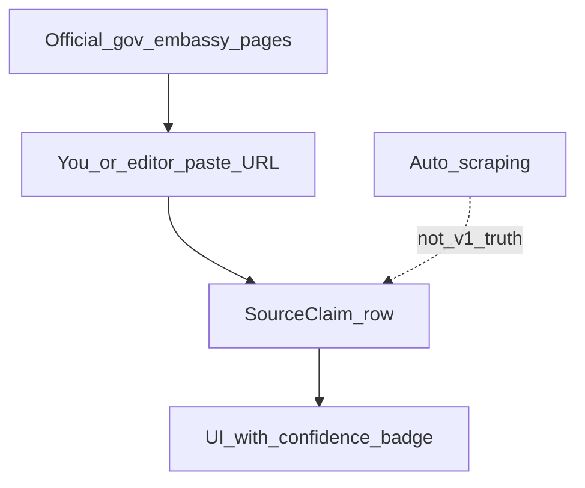

# Elsewhere — Product Clarity Map

**Purpose:** Kill the fog. One page that answers: *what is this site, which pieces are real, where does info come from, and what only you decide.*  
**Date:** 2026-07-14  
**Read this first** if the product feels too big. Deeper docs stay in the plans folder.

**Companions:** [ELSEWHERE_FOUNDATION.md](./ELSEWHERE_FOUNDATION.md) · [BUSINESS_PLAN_AND_LAUNCH_REPORT.md](./BUSINESS_PLAN_AND_LAUNCH_REPORT.md) · [BUILD_CHECKLIST.md](./BUILD_CHECKLIST.md) · [SOURCE_VERIFICATION_SYSTEM.md](../../SOURCE_VERIFICATION_SYSTEM.md)

---

## 0. North star (locked 2026-07-17)

> **“I’m actually going — and I know the one thing to do before Sunday.”**

**Leaving is the metric.** Research, quizzes, tools, claims, community, and paid
features are useful only when they help a person take a trustworthy action in
the real world. The core habit is:

1. One next action this week.
2. An official-source touch when the action depends on a factual rule.
3. A human signal when accountability or belonging helps.

Do not optimize for reading, quiz completion, tool count, or time in app as ends
in themselves. Before prioritizing a feature, ask: **does this make leaving more
real, safer, and more likely before the week ends?**

### CEO operating covenant

Every builder must surface a concise **`CEO Message:`** in substantive responses:
the direction, risk, deadline, or decision that most protects the north star.
Builders must challenge and rework failure-shaped requests instead of passively
executing them: disconnected tools, vanity engagement, premature ecosystem
scope, unsupported authority, or work that delays learning whether users take
real-world action.

Elsewhere cannot guarantee success. It can operate so failure signals arrive
early: smallest trustworthy experiments, explicit deadlines, observable
outcomes, and repeated course correction. The owner retains final authority
after the conflict and safer alternative are made clear.

### Strategic edge (locked 2026-07-22)

Compete on **certainty + time-to-first-real-action**, not on “AI answers” or a
new abstract framework. The frontier UX is the **Sunday Action** pattern on
every serious surface:

1. One primary next action (doable this week).
2. Trust strip (source / freshness / not legal advice).
3. Done this week? (user marks complete, including offline).
4. Evidence boundary (what this supports — and does **not**).

**Corridors, not brochures.** Pages help someone cross a life-event path
(e.g. US → PH Entry/Stay), not browse a wiki.

**Reality is the moat.** Official pages authorize claims after human-attested
capture + review. Forums/blogs are anecdotal UX research only — never legal
authority. AI may discover URLs, draft wording from packages, and design UI;
AI may **not** invent stay lengths, nationality lists, fees, or “you qualify.”

**Solo-operator model (current reality):** No hired writers or partners yet.
Owner is the MFA-gated publisher, not a content author inventing guidance.
Staff work = open the official URL, attest what the page says, approve, publish.
Later: source-monitor auto-detects page change → marks stale → human re-approves
(high value, after the first wedge exists). Designated country reps come after
revenue — do not wait for them to ship Phase A.

**Sequence (ruthless):** PH publish + Sunday Action live → weekly habit (Phase B)
→ TH/MX / referrals / multilingual (Phase C). Do not invent a second product
philosophy from ChatGPT/Hormozi notes; those reinforce this edge only.

**Value test:** Does this raise dream outcome × perceived likelihood, or shrink
time/effort to a trustworthy next step? If not, park it.

---

## 1. What Elsewhere is (one sentence)

A **calm relocation planning OS** that turns verified research into one doable
weekly action for people under pressure to move abroad. Not a travel blog, visa
mill, or fake partner marketplace.

**Mission test:** Every page should answer *“What do I do next — before this
week ends?”* honestly.

---

## 2. The three surfaces → **one site now**

**Locked 2026-07-14:** Marketing + product live in **one** Next app. One Supabase. See [ONE_SITE_ONE_AUTH.md](./ONE_SITE_ONE_AUTH.md).

| Route | Role |
|-------|------|
| `/` | Marketing (Spline Earth, waitlist, Log in → `/login`) |
| `/start` | Product hub (“Your move plan”) |
| `/app/*` | Fit Quiz, path, dashboard, tools |
| `/login`, `/signup` | Auth on **this same origin** |

| Legacy | Status |
|--------|--------|
| elsewhere-mu Vite | **Retire** after this deploy (redirect optional) |
| elsewhere-app-theta | Absorb polish later; not a second home |
| Second Supabase | **Never** for this brand |

---

## 3. Site map of *this* product

**Status key**

| Status | Meaning |
|--------|---------|
| **Live** | Usable structure + UI |
| **Demo-local** | Works with browser `localStorage` (no real cloud account yet) |
| **Stub** | Honest placeholder / light education — not deep content |
| **Legal** | Required policy pages |

### A — Core path (v1 wedge)

| Route | Status | What it is |
|-------|--------|------------|
| `/` | Live | Marketing home — Earth, waitlist, CTAs into app |
| `/start` | Live | Product hub — tool list + Fit Quiz entry |
| `/app/onboarding` | Demo-local | Fit Quiz (readiness profile) |
| `/app/path` | Demo-local | Corridor research path + checklist + claim badges |
| `/app/dashboard` | Demo-local | Score, best-fit, next step |
| `/app/my-plan` | Demo-local | 30-day outline template |
| `/app/passport` | Demo-local | Passport checklist (metadata only) |
| `/app/budget` | Demo-local | Budget / runway calculator |
| `/app/saved` | Demo-local | Saved countries |
| `/app/settings` | Demo-local | Local demo settings |

### B — Research tools

| Route | Status | What it is |
|-------|--------|------------|
| `/corridors` | Live | US → PH / TH / MX published corridors |
| `/countries` | Live | Country list (seed data) |
| `/countries/[slug]` | Live | Country notes + claims display |
| `/compare` | Live | Side-by-side compare |
| `/visa-compass` | Live | Visa research cards (confidence / needs verification) |
| `/passport-checklist` | Demo-local | Public passport tool |
| `/budget-calculator` | Demo-local | Public budget tool |

### C — Trust & business

| Route | Status | What it is |
|-------|--------|------------|
| `/trust` | Live | How we source / honesty model |
| `/pricing` | Live | Tier UI — no Stripe yet |
| `/partners` | Stub | Empty / pending — never invent partners |
| `/become-a-partner` | Live | Application form (manual review) |
| `/about` | Live | Brand about |
| `/login`, `/signup` | Demo-local | Demo account → localStorage |
| `/privacy`, `/terms` | Legal | Planning-info disclaimers |

### D — Education stubs (house now, furniture later)

| Route | Status | What it is |
|-------|--------|------------|
| `/housing` | Stub | Rent-first education |
| `/property` | Stub | Buy-later caution |
| `/insurance` | Stub | Coverage categories education |
| `/community` | Stub | Cohorts later |
| `/blog` | Stub | Journal placeholder |

### User journey (happy path)

Guest can start Fit Quiz **without** a real account. Progress is local until Supabase exists.

---

## 4. Features: what matters vs noise

| Capability | Now | Later | Why it exists |
|------------|-----|-------|---------------|
| Fit Quiz → corridor hypothesis | Demo (localStorage) | Cloud sync | Core wedge |
| Path + checklist + claim badges | Seeded PH / TH / MX | Admin-edited packs | Answers “what next?” |
| Compare / Visa Compass | Seed UI | DB-backed scores/claims | Research without guru tone |
| Waitlist | Device-local | Email provider webhook | Capture interest |
| Partners | Application form only | Verified directory | Never fake listings |
| Auth / cloud plan | Not real yet | Supabase | Needs your project |
| Document vault | Out of scope | Encrypted architecture first | Trust / safety rule |
| Mobile app | Responsive web | Expo later | Same product tokens |

### v1 shipped definition (narrow)

A guest can:

1. Run Fit Quiz for **US → Philippines / Thailand / Mexico**  
2. See a **research path** with honest `needs_review` claims  
3. Use **budget + passport** tools  
4. Report outdated info where forms exist  

**Not in v1:** payments, fake partners, ID/passport file uploads, scraped “truth,” “you qualify” language.

---

## 5. Where information comes from (the big fog)

### v1 truth model (locked)

| Question | Answer |
|----------|--------|
| **Source of authority?** | Official immigration / government / embassy pages. Licensed pros only for *referrals* later — never as invented “verified” listings. |
| **Who enters claims?** | Human editor (you + agent drafting). Not Wikipedia. Not Reddit as authority. |
| **How does it show in UI?** | `SourceClaim`: plain-English summary + source name/URL + confidence + review status (`needs_review` / verified). |
| **What do users see today?** | Seed data in `apps/web/lib/seed-corridors.ts` and country seeds — mostly **needs_review** / planning estimates **on purpose**. |
| **What we refuse in v1** | Scrape-as-truth · invent stay lengths · high confidence without URL + human verify · “you qualify / guaranteed visa.” |
| **Your one content job** | Paste **1–3 official URLs per corridor** (PH / TH / MX). We attach claims and only raise confidence after review. |

**Cost of living / lifestyle scores** stay labeled **planning estimates** until cited process exists.

Full rules: [`SOURCE_VERIFICATION_SYSTEM.md`](../../SOURCE_VERIFICATION_SYSTEM.md). Platform rule: *content is data* — adding a country = new corridor rows, not a rewrite ([`ELSEWHERE_FOUNDATION.md`](./ELSEWHERE_FOUNDATION.md)).

### Official URL paste box (YOU)

| Corridor | Official URL(s) | Notes |
|----------|-----------------|-------|
| Philippines | | Immigration / extension research |
| Thailand | | Immigration / entry exemption research |
| Mexico | | Immigration / tourist vs residency research |

---

## 6. Money, accounts, partners (short)

**Money**  
Free tools lead (quiz, path, compare, checklists). Paid later: saved plans, deeper packs, alerts. **No Stripe in v1.** Pricing page is structural only.

**Accounts**  
Today: demo email → `localStorage`. Real accounts = **Supabase** when you create the project. Same UX, cloud persistence.

**Partners**  
Forms + status enums (`pending_verification`, `verified`, `demo`, etc.). Verified attorneys / housing / insurance appear **only after real vetting**. Until then: empty states and “verification pending” — never invented people.

---

## 7. What only YOU still need to decide

| # | Decision | Blocks |
|---|----------|--------|
| 1 | **Domain** (elsewhere.com / .app / other) | Production brand URL |
| 2 | **Supabase** project + keys | Real auth / saved plans |
| 3 | **Waitlist** email provider + webhook | Real email capture |
| 4 | **Official URLs** for PH / TH / MX (table above) | Upgrading claim confidence |
| 5 | **Legal entity** name in footer if not “Elsewhere” | Footer / Terms |
| 6 | Confirm which **Vercel** project owns product production | Deploy clarity |
| 7 | **Walk Fit Quiz once** and list friction | Product polish |
| 8 | Optional: DNS redirect elsewhere-mu → this site | Kill dual marketing |

Repo rename to `elsewhere-app` is **done**. Local folder may stay `expat-atlas`.  
**One site + one Supabase:** [ONE_SITE_ONE_AUTH.md](./ONE_SITE_ONE_AUTH.md).

---

## 8. How to use this map day-to-day

1. Confused about “what are we building?” → **§1–4**  
2. Confused about “where does visa info come from?” → **§5**  
3. Ready to unblock the business → **§7** (in order)  
4. Ready to code → [`BUILD_CHECKLIST.md`](./BUILD_CHECKLIST.md) + [`HANDOFF.md`](../../HANDOFF.md)

**Build order reminder:** Trust + sources before polish; no vault until encryption architecture; no fake partners.
