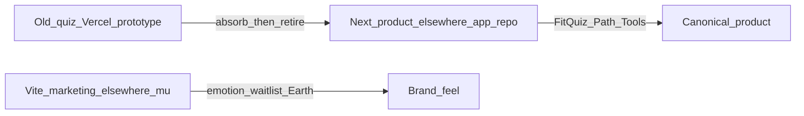
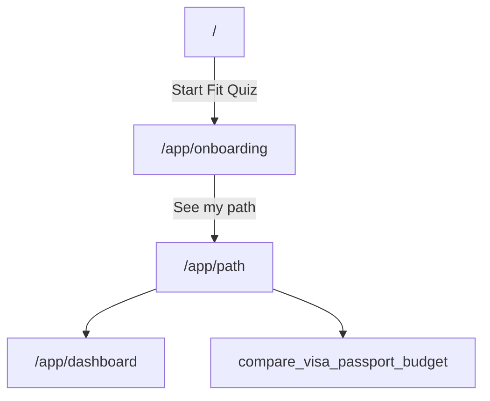
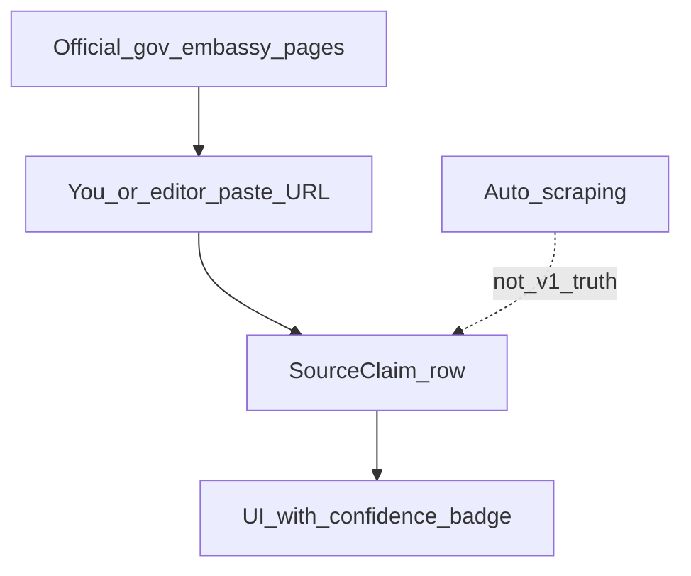

# Elsewhere — Product Clarity Map

**Purpose:** Kill the fog. One page that answers: *what is this site, which pieces are real, where does info come from, and what only you decide.*  
**Date:** 2026-07-14  
**Read this first** if the product feels too big. Deeper docs stay in the plans folder.

**Companions:** [ELSEWHERE_FOUNDATION.md](./ELSEWHERE_FOUNDATION.md) · [BUSINESS_PLAN_AND_LAUNCH_REPORT.md](./BUSINESS_PLAN_AND_LAUNCH_REPORT.md) · [BUILD_CHECKLIST.md](./BUILD_CHECKLIST.md) · [SOURCE_VERIFICATION_SYSTEM.md](../../SOURCE_VERIFICATION_SYSTEM.md)

---

## 1. What Elsewhere is (one sentence)

A **calm relocation planning OS** — Fit Quiz → research path → checklists and tools — for people under pressure to move abroad. Not a travel blog, visa mill, or fake partner marketplace.

**Mission test:** Every page should answer *“What do I do next?”* honestly.

---

## 2. The three surfaces (which site is “real”?)

| Surface | Where | Role |
|---------|--------|------|
| Marketing Earth landing | https://elsewhere-mu.vercel.app · Vite repo `Elsewhere` | Brand emotion + waitlist feel — **not** the product OS |
| **This product (canonical)** | GitHub [`ltvaughan19/elsewhere-app`](https://github.com/ltvaughan19/elsewhere-app) · Vercel `expat-atlas-web` · local folder may still be `expat-atlas` | Fit Quiz → Path → tools — **build here** |
| Old quiz prototype | https://elsewhere-app-theta.vercel.app | Sample UX to absorb later, then retire |

**Locked rule:** One product monorepo. Do not copy the cinematic Earth hero into the product home. Marketing can later deep-link to this app’s Fit Quiz.

---

## 3. Site map of *this* product

**Status key**

| Status | Meaning |
|--------|---------|
| **Live** | Usable structure + UI |
| **Demo-local** | Works with browser `localStorage` (no real cloud account yet) |
| **Stub** | Honest placeholder / light education — not deep content |
| **Legal** | Required policy pages |

### A — Core path (v1 wedge)

| Route | Status | What it is |
|-------|--------|------------|
| `/` | Live | Product home — “Your move plan” + tool list (not marketing Earth) |
| `/app/onboarding` | Demo-local | Fit Quiz (readiness profile) |
| `/app/path` | Demo-local | Corridor research path + checklist + claim badges |
| `/app/dashboard` | Demo-local | Score, best-fit, next step |
| `/app/my-plan` | Demo-local | 30-day outline template |
| `/app/passport` | Demo-local | Passport checklist (metadata only) |
| `/app/budget` | Demo-local | Budget / runway calculator |
| `/app/saved` | Demo-local | Saved countries |
| `/app/settings` | Demo-local | Local demo settings |

### B — Research tools

| Route | Status | What it is |
|-------|--------|------------|
| `/corridors` | Live | US → PH / TH / MX published corridors |
| `/countries` | Live | Country list (seed data) |
| `/countries/[slug]` | Live | Country notes + claims display |
| `/compare` | Live | Side-by-side compare |
| `/visa-compass` | Live | Visa research cards (confidence / needs verification) |
| `/passport-checklist` | Demo-local | Public passport tool |
| `/budget-calculator` | Demo-local | Public budget tool |

### C — Trust & business

| Route | Status | What it is |
|-------|--------|------------|
| `/trust` | Live | How we source / honesty model |
| `/pricing` | Live | Tier UI — no Stripe yet |
| `/partners` | Stub | Empty / pending — never invent partners |
| `/become-a-partner` | Live | Application form (manual review) |
| `/about` | Live | Brand about |
| `/login`, `/signup` | Demo-local | Demo account → localStorage |
| `/privacy`, `/terms` | Legal | Planning-info disclaimers |

### D — Education stubs (house now, furniture later)

| Route | Status | What it is |
|-------|--------|------------|
| `/housing` | Stub | Rent-first education |
| `/property` | Stub | Buy-later caution |
| `/insurance` | Stub | Coverage categories education |
| `/community` | Stub | Cohorts later |
| `/blog` | Stub | Journal placeholder |

### User journey (happy path)

Guest can start Fit Quiz **without** a real account. Progress is local until Supabase exists.

---

## 4. Features: what matters vs noise

| Capability | Now | Later | Why it exists |
|------------|-----|-------|---------------|
| Fit Quiz → corridor hypothesis | Demo (localStorage) | Cloud sync | Core wedge |
| Path + checklist + claim badges | Seeded PH / TH / MX | Admin-edited packs | Answers “what next?” |
| Compare / Visa Compass | Seed UI | DB-backed scores/claims | Research without guru tone |
| Waitlist | Device-local | Email provider webhook | Capture interest |
| Partners | Application form only | Verified directory | Never fake listings |
| Auth / cloud plan | Not real yet | Supabase | Needs your project |
| Document vault | Out of scope | Encrypted architecture first | Trust / safety rule |
| Mobile app | Responsive web | Expo later | Same product tokens |

### v1 shipped definition (narrow)

A guest can:

1. Run Fit Quiz for **US → Philippines / Thailand / Mexico**  
2. See a **research path** with honest `needs_review` claims  
3. Use **budget + passport** tools  
4. Report outdated info where forms exist  

**Not in v1:** payments, fake partners, ID/passport file uploads, scraped “truth,” “you qualify” language.

---

## 5. Where information comes from (the big fog)

### v1 truth model (locked)

| Question | Answer |
|----------|--------|
| **Source of authority?** | Official immigration / government / embassy pages. Licensed pros only for *referrals* later — never as invented “verified” listings. |
| **Who enters claims?** | Human editor (you + agent drafting). Not Wikipedia. Not Reddit as authority. |
| **How does it show in UI?** | `SourceClaim`: plain-English summary + source name/URL + confidence + review status (`needs_review` / verified). |
| **What do users see today?** | Seed data in `apps/web/lib/seed-corridors.ts` and country seeds — mostly **needs_review** / planning estimates **on purpose**. |
| **What we refuse in v1** | Scrape-as-truth · invent stay lengths · high confidence without URL + human verify · “you qualify / guaranteed visa.” |
| **Your one content job** | Paste **1–3 official URLs per corridor** (PH / TH / MX). We attach claims and only raise confidence after review. |

**Cost of living / lifestyle scores** stay labeled **planning estimates** until cited process exists.

Full rules: [`SOURCE_VERIFICATION_SYSTEM.md`](../../SOURCE_VERIFICATION_SYSTEM.md). Platform rule: *content is data* — adding a country = new corridor rows, not a rewrite ([`ELSEWHERE_FOUNDATION.md`](./ELSEWHERE_FOUNDATION.md)).

### Official URL paste box (YOU)

| Corridor | Official URL(s) | Notes |
|----------|-----------------|-------|
| Philippines | | Immigration / extension research |
| Thailand | | Immigration / entry exemption research |
| Mexico | | Immigration / tourist vs residency research |

---

## 6. Money, accounts, partners (short)

**Money**  
Free tools lead (quiz, path, compare, checklists). Paid later: saved plans, deeper packs, alerts. **No Stripe in v1.** Pricing page is structural only.

**Accounts**  
Today: demo email → `localStorage`. Real accounts = **Supabase** when you create the project. Same UX, cloud persistence.

**Partners**  
Forms + status enums (`pending_verification`, `verified`, `demo`, etc.). Verified attorneys / housing / insurance appear **only after real vetting**. Until then: empty states and “verification pending” — never invented people.

---

## 7. What only YOU still need to decide

| # | Decision | Blocks |
|---|----------|--------|
| 1 | **Domain** (elsewhere.com / .app / other) | Production brand URL |
| 2 | **Supabase** project + keys | Real auth / saved plans |
| 3 | **Waitlist** email provider + webhook | Real email capture |
| 4 | **Official URLs** for PH / TH / MX (table above) | Upgrading claim confidence |
| 5 | **Legal entity** name in footer if not “Elsewhere” | Footer / Terms |
| 6 | Confirm which **Vercel** project owns product production | Deploy clarity |
| 7 | **Walk Fit Quiz once** and list friction | Product polish |
| 8 | Optional: point marketing (elsewhere-mu) CTA → this Fit Quiz | One funnel |

Repo rename to `elsewhere-app` is **done**. Local folder may stay `expat-atlas`.

---

## 8. How to use this map day-to-day

1. Confused about “what are we building?” → **§1–4**  
2. Confused about “where does visa info come from?” → **§5**  
3. Ready to unblock the business → **§7** (in order)  
4. Ready to code → [`BUILD_CHECKLIST.md`](./BUILD_CHECKLIST.md) + [`HANDOFF.md`](../../HANDOFF.md)

**Build order reminder:** Trust + sources before polish; no vault until encryption architecture; no fake partners.
